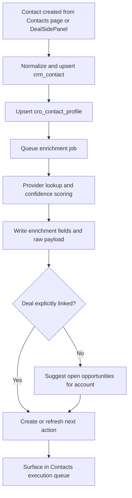
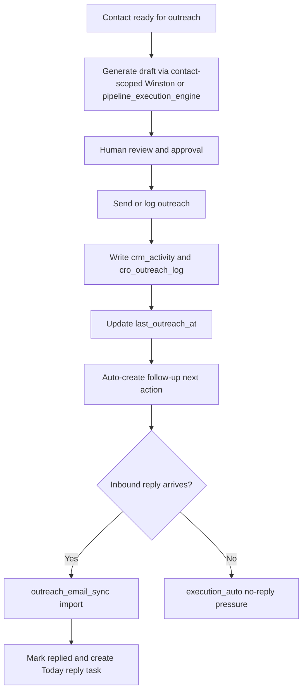
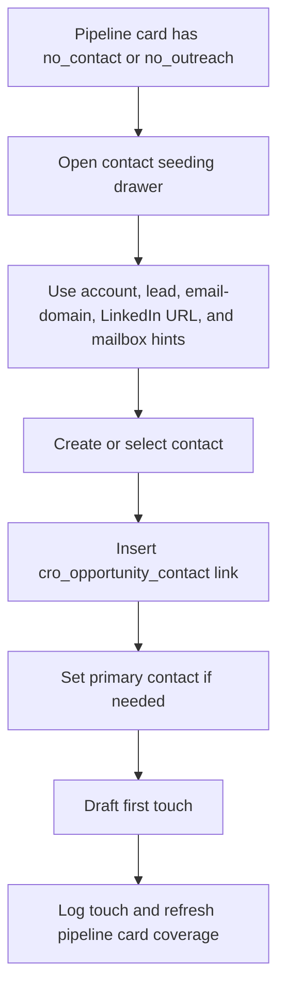

# Contacts Execution Surface Inventory Report for Consulting_app

## Executive summary

The repository already contains most of the primitives needed to turn Contacts into a serious execution surface rather than a passive address book. The codebase has a native CRM layer (`crm_account`, `crm_contact`, `crm_opportunity`, `crm_activity`), CRO extensions for lead/contact profiles and outreach, a next-action engine, an execution-board/task engine, normalized email-ingest infrastructure, a consulting API router, a working pipeline board, and a deal-side panel that is already richer than the current Contacts page. The fastest path is therefore not to invent a new subsystem, but to compose and extend what is already there. fileciteturn30file0L1-L1 fileciteturn32file0L1-L1 fileciteturn53file0L1-L1 fileciteturn55file0L1-L1 fileciteturn58file0L1-L1 fileciteturn57file0L1-L1 fileciteturn27file0L1-L1

The highest-leverage architectural move is to make Contacts first-class in deal execution by adding an explicit opportunity-to-contact linkage model, then wiring enrichment and outreach generation into the existing next-action, execution-task, and email-sync engines. Right now, the system can create contacts, log outreach, create next actions, generate opportunity drafts/follow-ups/prep, and even auto-create reply tasks from imported email, but the Contacts page itself is still a thin list/filter/create experience while most execution happens in the deal drawer and pipeline surface. fileciteturn6file0L1-L1 fileciteturn18file0L1-L1 fileciteturn15file0L1-L1 fileciteturn24file0L1-L1 fileciteturn25file0L1-L1 fileciteturn37file0L1-L1

The main implementation risk is not feature absence but schema and surface inconsistency. There are clear signs of schema drift or partial migrations: `cro_leads.py` depends on `cro_lead_profile.score_breakdown` and `pipeline_stage`, which are introduced in migration 311 rather than 280; `execution_auto.py` references `o.stage` even though the base `crm_opportunity` schema defines `crm_pipeline_stage_id` but not `stage`; and several services reference `crm_activity.notes` or `activity_date`, while the inspected base CRM migration defines `payload_json` and `activity_at`. Those mismatches should be resolved before or alongside Contacts work. fileciteturn51file0L1-L1 fileciteturn53file0L1-L1 fileciteturn24file0L1-L1 fileciteturn30file0L1-L1 fileciteturn21file0L1-L1 fileciteturn36file0L1-L1

## Repository inventory and current architecture

I inspected the following repository files to build this report: `backend/app/routes/crm.py`, `backend/app/routes/consulting.py`, `backend/app/services/cro_entity_detail.py`, `backend/app/services/cro_leads.py`, `backend/app/services/cro_next_actions.py`, `backend/app/services/cro_outreach.py`, `backend/app/services/cro_seed.py`, `backend/app/services/execution_auto.py`, `backend/app/services/execution_quick_capture.py`, `backend/app/services/outreach_email_sync.py`, `backend/app/services/pipeline_execution_engine.py`, `backend/app/services/winston_assist.py`, `repo-b/db/schema/260_crm_native.sql`, `repo-b/db/schema/280_consulting_revenue_os.sql`, `repo-b/db/schema/311_crm_next_actions.sql`, `repo-b/db/schema/457_pipeline_operator_layer.sql`, `repo-b/db/schema/525_execution_board.sql`, `repo-b/db/schema/606_outreach_email_sync.sql`, `repo-b/src/lib/cro-api.ts`, `repo-b/src/app/lab/env/[envId]/consulting/contacts/page.tsx`, `repo-b/src/app/lab/env/[envId]/consulting/pipeline/page.tsx`, `repo-b/src/app/lab/env/[envId]/consulting/pipeline/[opportunityId]/page.tsx`, `repo-b/src/components/consulting/PipelineLaneView.tsx`, `repo-b/src/components/consulting/DealSidePanel.tsx`, `repo-b/src/app/lab/env/[envId]/operator/_sidebar.tsx`, and `repo-b/src/app/bos/api/consulting/leads/route.ts`. fileciteturn19file0L1-L1 fileciteturn27file0L1-L1 fileciteturn6file0L1-L1 fileciteturn51file0L1-L1 fileciteturn20file0L1-L1 fileciteturn21file0L1-L1 fileciteturn22file0L1-L1 fileciteturn24file0L1-L1 fileciteturn23file0L1-L1 fileciteturn25file0L1-L1 fileciteturn37file0L1-L1 fileciteturn36file0L1-L1 fileciteturn30file0L1-L1 fileciteturn32file0L1-L1 fileciteturn53file0L1-L1 fileciteturn55file0L1-L1 fileciteturn58file0L1-L1 fileciteturn57file0L1-L1 fileciteturn11file0L1-L1 fileciteturn15file0L1-L1 fileciteturn16file0L1-L1 fileciteturn50file0L1-L1 fileciteturn17file0L1-L1 fileciteturn18file0L1-L1 fileciteturn45file0L1-L1 fileciteturn65file0L1-L1

The relevant modules break down cleanly into five layers:

| Layer | Files/modules | What they already do |
|---|---|---|
| Core CRM + CRO schema | `260_crm_native.sql`, `280_consulting_revenue_os.sql`, `311_crm_next_actions.sql` | Define accounts, contacts, opportunities, activities, lead profiles, contact profiles, outreach log, proposals, clients, engagements, and next actions. fileciteturn30file0L1-L1 fileciteturn32file0L1-L1 fileciteturn53file0L1-L1 |
| Execution layer | `457_pipeline_operator_layer.sql`, `525_execution_board.sql`, `execution_auto.py`, `execution_quick_capture.py`, `pipeline_execution_engine.py` | Track execution profiles, audit trail, daily tasks, auto-generated pressure tasks, quick-capture parsing, and AI/deterministic draft generation. fileciteturn55file0L1-L1 fileciteturn58file0L1-L1 fileciteturn24file0L1-L1 fileciteturn23file0L1-L1 fileciteturn37file0L1-L1 |
| Outreach + mail sync | `cro_outreach.py`, `outreach_email_sync.py`, `606_outreach_email_sync.sql` | Log outbound/inbound contact touches, derive reply tasks, normalize provider payloads, and store message-level linking and dedupe state. fileciteturn21file0L1-L1 fileciteturn25file0L1-L1 fileciteturn57file0L1-L1 |
| API surface | `backend/app/routes/consulting.py`, `backend/app/routes/crm.py`, `repo-b/src/lib/cro-api.ts`, `repo-b/src/app/bos/api/consulting/leads/route.ts` | Expose the consulting API, low-level CRM routes, typed frontend calls, and at least one direct Next.js BOS route pattern. fileciteturn27file0L1-L1 fileciteturn19file0L1-L1 fileciteturn11file0L1-L1 fileciteturn65file0L1-L1 |
| Frontend operating surfaces | Contacts page, pipeline page, pipeline detail page, `PipelineLaneView`, `DealSidePanel`, sidebar | Show contact list/filter/create, pipeline board/triage, opportunity detail, lane rendering, and deal-level contact/outreach/action operations. fileciteturn15file0L1-L1 fileciteturn16file0L1-L1 fileciteturn50file0L1-L1 fileciteturn17file0L1-L1 fileciteturn18file0L1-L1 fileciteturn45file0L1-L1 |

The most important current behavior for the Contacts surface is that the pipeline page already has native triage concepts for “no action,” “no contact,” and “no outreach,” because `contact_count`, `outreach_count`, and `next_action_description` are loaded into board cards and used in filters. That means the pipeline is already telling you where contact work is missing; the Contacts surface should become the operational destination for fixing those gaps. fileciteturn16file0L1-L1 fileciteturn37file0L1-L1

## Data model and schema extensions

The base data model is solid but too account-centric for serious contact execution. `crm_contact` belongs to an account, `crm_opportunity` has only one `primary_contact_id`, and `cro_contact_profile` captures only a small amount of execution metadata (`linkedin_url`, `relationship_strength`, `decision_role`, `last_outreach_at`, `notes`). That is enough for list rendering, but not enough for enrichment state, multi-stakeholder mapping, or sequence orchestration. fileciteturn30file0L1-L1 fileciteturn32file0L1-L1

The highest-confidence schema extensions are below.

| Table | Current shape used by repo | Exact attributes to add | Why this matters |
|---|---|---|---|
| `crm_contact` | `crm_account_id`, `first_name`, `last_name`, `full_name`, `email`, `phone`, `title`, `external_key`, `is_active` fileciteturn30file0L1-L1 | `email_status text`, `email_status_reason text`, `email_domain text`, `department text`, `seniority text`, `location_text text`, `source_system text`, `source_ref text`, `source_confidence numeric(5,4)`, `enrichment_status text`, `enrichment_provider text`, `enrichment_hash text`, `last_enriched_at timestamptz`, `last_verified_at timestamptz`, `persona_tags jsonb default '[]'::jsonb`, `buying_roles jsonb default '[]'::jsonb` | Makes enrichment durable and queryable without bloating `cro_contact_profile` with mixed provenance/state. |
| `cro_contact_profile` | `linkedin_url`, `relationship_strength`, `decision_role`, `last_outreach_at`, `notes` fileciteturn32file0L1-L1 | `preferred_channel text`, `preferred_channel_confidence numeric(5,4)`, `influence_score int`, `reachability_score int`, `buyer_persona text`, `headline text`, `linkedin_slug text`, `company_domain text`, `enrichment_raw jsonb default '{}'::jsonb`, `last_enrichment_error text`, `do_not_contact boolean default false`, `consent_status text`, `contact_owner text` | Keeps execution-facing fields close to outreach behavior and lets the Contacts page become a cockpit. |
| `crm_opportunity` | `crm_account_id`, `primary_contact_id`, `crm_pipeline_stage_id`, `amount`, `expected_close_date`, `status` fileciteturn30file0L1-L1 | `contact_gap_status text`, `outreach_gap_status text`, `last_contact_linked_at timestamptz` | Adds explicit denormalized pressure flags so pipeline rendering does not need repeated lateral joins. |
| **New** `cro_opportunity_contact` | Not present in inspected schema; current code mostly infers contacts from account membership and `primary_contact_id`. fileciteturn6file0L1-L1 fileciteturn18file0L1-L1 | `id uuid pk`, `env_id text`, `business_id uuid`, `crm_opportunity_id uuid`, `crm_contact_id uuid`, `role_on_deal text`, `influence_level text`, `is_primary boolean default false`, `is_active boolean default true`, `link_source text`, `link_confidence numeric(5,4)`, `notes text`, `created_at timestamptz`, `updated_at timestamptz`, unique(`crm_opportunity_id`,`crm_contact_id`) | This is the single most important missing relational primitive. It lets one account have many contacts and each deal have a specific buying committee. |
| `cro_outreach_log` | Account/contact/template/channel/direction/subject/body/sent/replied/meeting/bounce/sent_by fileciteturn32file0L1-L1 | `provider text`, `provider_message_id text`, `provider_thread_id text`, `sequence_key text`, `sequence_step int`, `delivery_status text`, `opened_at timestamptz`, `clicked_at timestamptz`, `bounced_at timestamptz`, `idempotency_key text` | Makes outbound sending and downstream event processing reliable when transport is added. |
| `cro_next_action` | Polymorphic entity/action/due/status/priority/notes fileciteturn53file0L1-L1 | `generator text`, `generator_ref uuid`, `dedupe_key text`, `blocking_contact_id uuid`, `sequence_step int`, `snoozed_until timestamptz` | Lets contact-derived actions coexist cleanly with opportunity- and account-derived actions. |

The repo also strongly suggests adding one more orchestration table once outbound automation is live:

| Proposed table | Exact attributes |
|---|---|
| `cro_contact_sequence_state` | `id uuid pk`, `env_id text`, `business_id uuid`, `crm_contact_id uuid`, `crm_account_id uuid`, `crm_opportunity_id uuid`, `channel text`, `sequence_key text`, `current_step int`, `status text`, `last_outreach_log_id uuid`, `provider_thread_id text`, `next_due_at timestamptz`, `paused_reason text`, `created_at timestamptz`, `updated_at timestamptz` |

That table is not required for MVP, but it becomes worthwhile as soon as the Contacts page can trigger multi-step outreach and the system must avoid duplicate sends.

## Backend hook points

The repo already exposes clean code-level insertion points for the five workflows you asked about.

| Concern | Primary hook point | Why this is the right place | Recommended change | Priority |
|---|---|---|---|---|
| Contact ingestion | `backend/app/services/cro_entity_detail.py::create_contact` and `backend/app/services/cro_leads.py::create_lead` | These are the existing contact creation paths used by the Contacts page and lead creation flow. fileciteturn6file0L1-L1 fileciteturn51file0L1-L1 | Wrap both in a shared `contacts_upsert.py` service that normalizes names, lowercases email, computes `email_domain`, creates/updates `cro_contact_profile`, and optionally inserts `cro_opportunity_contact`. | MVP |
| Enrichment | **New service** `backend/app/services/contact_enrichment.py`, invoked immediately after `create_contact` and by a sweeper job | Existing schema has nowhere durable to store provider/state metadata yet, but `cro_contact_profile` is the natural execution extension and `outreach_email_sync.resolve_crm_links` already shows how account/contact resolution is done. fileciteturn32file0L1-L1 fileciteturn25file0L1-L1 | Add `enqueue_contact_enrichment(contact_id, mode='inline'|'async')`, provider adapters, raw payload capture, and score/confidence updates. | MVP |
| Next-action generation | `cro_next_actions.create_next_action`; also `cro_outreach.log_outreach`, `cro_outreach.record_reply`, `cro_leads.create_lead`, `cro_leads.update_lead_pipeline_stage`, `execution_auto.run_auto_generation`, `execution_quick_capture.quick_capture` | The repo already auto-generates actions from lead creation, replies, stale deals, no-next-action deals, outreach no-reply, and quick-capture. fileciteturn20file0L1-L1 fileciteturn21file0L1-L1 fileciteturn24file0L1-L1 fileciteturn23file0L1-L1 fileciteturn51file0L1-L1 | Add a contact-specific generator pass: “new contact needs enrichment,” “contact enriched but not linked to any open deal,” “contact linked to deal but no first touch,” and “contact replied — buyer map needs promotion.” | MVP |
| Deal linking | `cro_entity_detail` opportunity/contact reads, `execution_quick_capture._find_open_deal_for_account`, `outreach_email_sync.resolve_crm_links`, and `pipeline_execution_engine._load_rows` | Current linking logic is mostly inferred from account membership or latest open opportunity. That is useful for fallback, but not precise enough for an execution-grade Contacts surface. fileciteturn6file0L1-L1 fileciteturn23file0L1-L1 fileciteturn25file0L1-L1 fileciteturn37file0L1-L1 | Introduce `cro_opportunity_contact`, then update readers/writers to prefer explicit deal-contact links and only fall back to account-based inference. | MVP |
| Winston outreach generation | `pipeline_execution_engine.draft_outreach`, `generate_followups`, `meeting_prep`; `winston_assist.generate_assist`; `DealSidePanel.runQuickAction` | These functions already generate structured draft stacks, follow-up angles, meeting prep, and deal-scored AI assist. fileciteturn37file0L1-L1 fileciteturn36file0L1-L1 fileciteturn18file0L1-L1 | Expose contact-scoped variants that take `crm_contact_id` plus optional `crm_opportunity_id`, and store generated artifacts in `cro_contact_profile`/`cro_execution_profile` depending on scope. | MVP+ |

The single most natural API registration point is `backend/app/routes/consulting.py`, which already mounts consulting endpoints for pipeline execution board, opportunity drafts/follow-ups/prep, Winston assist, outreach logging, leads, and health. New contacts endpoints should be registered beside those rather than in the older generic `crm.py` router. fileciteturn27file0L1-L1 fileciteturn19file0L1-L1

A practical backend design is:

- keep **CRUD-ish** contact routes under `/api/consulting/contacts`
- keep **execution/intelligence** routes under `/api/consulting/contacts/{id}/...`
- keep **deal-linking** routes under `/api/consulting/opportunities/{opp_id}/contacts/...`
- keep **transport/event ingestion** routes under `/api/consulting/integrations/...`

That preserves the repo’s current pattern of thin route registration with most logic in service modules. fileciteturn27file0L1-L1

## Frontend hook points and UI behaviors

The current Contacts page is the obvious starting point, but its present responsibility is mostly list/filter/add. It loads contacts and leads, filters rows by missing email, missing LinkedIn, no account, and missing last outreach, and opens a small “Add Contact” form. That means the page already knows what its missing operational dimensions are; it just does not yet operationalize them. fileciteturn15file0L1-L1

The frontend modifications I would make are these:

| Frontend file/component | Current role | Recommended modification |
|---|---|---|
| `repo-b/src/app/lab/env/[envId]/consulting/contacts/page.tsx` | Contacts list, filters, add form, list item links. fileciteturn15file0L1-L1 | Turn into a three-pane execution surface: queue/filter rail, list grid, detail drawer. Add chips for `needs_enrichment`, `unlinked_to_deal`, `no_first_touch`, `last_touch_stale`, `reply_waiting`, and `do_not_contact`. |
| `repo-b/src/components/consulting/DealSidePanel.tsx` | Already supports add contact, log outreach, add next action, draft/follow-up/prep actions, and outreach log rendering. fileciteturn18file0L1-L1 | Reuse its Contacts/Outreach/Execution tabs inside a new reusable `ContactExecutionDrawer` so the Contacts page and pipeline page share the same operational affordances. |
| `repo-b/src/app/lab/env/[envId]/consulting/pipeline/page.tsx` | Pipeline board with triage search for `no action`, `no contact`, `no outreach`. fileciteturn16file0L1-L1 | Add “Seed contacts” CTA on cards where `contact_count === 0`, and open the contacts drawer pre-scoped to the selected opportunity/account. |
| `repo-b/src/components/consulting/PipelineLaneView.tsx` | Lane columns and card rendering. fileciteturn17file0L1-L1 | Add compact badges for contacts/outreach coverage; clicking the contact badge should jump into the contacts drawer filtered to deal-linked contacts. |
| `repo-b/src/app/lab/env/[envId]/consulting/pipeline/[opportunityId]/page.tsx` | Opportunity detail page with related contacts list and links to `/consulting/contacts/{crm_contact_id}`. fileciteturn50file0L1-L1 | Preserve this page as the “deal truth” surface, but make its contact links land on a real contact detail page. |
| **New** `repo-b/src/app/lab/env/[envId]/consulting/contacts/[contactId]/page.tsx` | Not found in the inspected inventory, though both the Contacts page and Opportunity detail page link to contact-detail URLs. fileciteturn15file0L1-L1 fileciteturn50file0L1-L1 | Implement a contact record page with timeline, linked deals, outreach history, next actions, enrichment payload, and Winston drafts. |
| `repo-b/src/lib/cro-api.ts` | Typed API client with consulting/pipeline/contact/deal functions and `CRO_BASE = "/bos/api/consulting"`. fileciteturn11file0L1-L1 | Add typed methods for new endpoints: `ingestContacts`, `enrichContact`, `linkContactToOpportunity`, `generateContactOutreach`, `seedContactsFromPipeline`, `fetchContactTimeline`. |
| `repo-b/src/app/lab/env/[envId]/operator/_sidebar.tsx` | Sidebar nav already includes Contacts. fileciteturn45file0L1-L1 | Keep Contacts in place, but optionally add sub-state count badges later via async loading. |

The key UI behavior changes should be pragmatic rather than decorative. On each contact row, I would add:

- a **coverage strip**: linked account, linked deals count, last touch, preferred channel, enrichment status
- one-click execution actions: **Enrich**, **Link to deal**, **Draft first touch**, **Log reply**, **Create next action**
- a **manual override discipline**: enriched fields should display provider and verification date and be editable
- a **contact-to-pipeline bridge**: clicking a linked deal should open the existing deal drawer or deal detail view

That would make the Contacts page converge toward the maturity already present in the pipeline and deal drawer rather than becoming its own separate paradigm. fileciteturn18file0L1-L1 fileciteturn16file0L1-L1 fileciteturn50file0L1-L1

## Automation workflows

The repo already supports the main building blocks for these workflows: deterministic contact/create paths, next-action creation, execution-task auto-generation, draft/follow-up/meeting-prep generation, and normalized email imports that can create reply tasks. The right design move is to thread contacts through those existing loops rather than build a second automation system. fileciteturn6file0L1-L1 fileciteturn20file0L1-L1 fileciteturn24file0L1-L1 fileciteturn25file0L1-L1 fileciteturn37file0L1-L1







These workflows map directly onto existing repo primitives. The only new durable join needed is the explicit opportunity-contact link, plus contact enrichment/status fields. Without that join, “pipeline linking” will remain probabilistic and account-scoped. fileciteturn23file0L1-L1 fileciteturn25file0L1-L1 fileciteturn24file0L1-L1

## Roadmap and implementation details

The implementation should be staged so that the Contacts surface becomes useful after the first sprint, not after a full integration program.

| Phase | Scope | Hooks/files | Effort | Risk |
|---|---|---|---|---|
| Stabilize foundation | Fix schema drift, verify migrations, add tests around contacts/leads/outreach reads and writes | `260`, `280`, `311`, `457`, `525`, `606`, plus affected services | 1–2 days | Medium |
| MVP contacts execution | Add `cro_opportunity_contact`, build contact detail page/drawer, add `link to deal`, `enrich`, and `draft first touch` actions | `contacts/page.tsx`, new contact page, `cro-api.ts`, `consulting.py`, `cro_entity_detail.py` | 3–5 days | Medium |
| Pipeline seeding | Add card-level “Seed contact” and contact coverage badges; update board payloads to prefer explicit links | `pipeline/page.tsx`, `PipelineLaneView.tsx`, `pipeline_execution_engine.py` | 2–4 days | Low-medium |
| Enrichment engine | Add async enrichment service and persistence fields; queue from contact create and nightly sweep | new service + migrations + schedule worker | 4–6 days | Medium |
| Outreach automation | Add contact-scoped draft generation, sequence state, and transport/adaptor integration | `winston_assist.py`, `pipeline_execution_engine.py`, `cro_outreach.py`, `outreach_email_sync.py` | 4–7 days | Medium-high |
| Closed-loop sync | Bring mailbox events and outbound transport events back into tasks and attribution | `606` tables/services + new integration routes | 5–8 days | High |

The API design should mirror the current consulting route style and the UUID-validation/direct-query discipline used in the BOS leads route. fileciteturn27file0L1-L1 fileciteturn65file0L1-L1

### Sample API contracts

Following the repo’s current JSON request style, I would add the following contracts.

```json
POST /api/consulting/contacts/ingest

{
  "env_id": "uuid",
  "business_id": "uuid",
  "crm_account_id": "uuid",
  "crm_opportunity_id": "uuid",
  "contacts": [
    {
      "full_name": "Jane Doe",
      "email": "jane@targetco.com",
      "phone": "+1-555-111-2222",
      "title": "Vice President of Operations",
      "linkedin_url": "https://www.linkedin.com/in/jane-doe",
      "source_system": "manual",
      "source_ref": "contacts_page",
      "decision_role": "decision_maker",
      "relationship_strength": "warm",
      "notes": "Met at ACG South Florida"
    }
  ],
  "link_mode": "link_if_open_deal_exists"
}
```

```json
200 OK

{
  "created": [
    {
      "crm_contact_id": "uuid",
      "crm_account_id": "uuid",
      "crm_opportunity_links": ["uuid"],
      "deduped": false,
      "enrichment_status": "queued"
    }
  ],
  "updated": [],
  "errors": []
}
```

```json
POST /api/consulting/contacts/{contact_id}/enrich

{
  "env_id": "uuid",
  "business_id": "uuid",
  "provider": "clearbit_like",
  "mode": "async"
}
```

```json
200 OK

{
  "crm_contact_id": "uuid",
  "status": "queued",
  "provider": "clearbit_like",
  "started_at": "2026-05-06T14:00:00Z"
}
```

```json
POST /api/consulting/opportunities/{opportunity_id}/contacts/link

{
  "env_id": "uuid",
  "business_id": "uuid",
  "crm_contact_id": "uuid",
  "role_on_deal": "economic_buyer",
  "influence_level": "high",
  "is_primary": true,
  "link_source": "contacts_surface"
}
```

```json
POST /api/consulting/contacts/{contact_id}/outreach/generate

{
  "env_id": "uuid",
  "business_id": "uuid",
  "crm_opportunity_id": "uuid",
  "channel": "email",
  "goal": "book_meeting"
}
```

```json
200 OK

{
  "draft": {
    "subject": "One sharp subject line",
    "body": "One sharp first-touch email"
  },
  "recommended_next_action": {
    "action_type": "follow_up",
    "description": "Follow up in 3 days if no reply"
  }
}
```

### Migration suggestions

A minimal SQL bundle for MVP would look like this:

```sql
CREATE TABLE IF NOT EXISTS cro_opportunity_contact (
  id uuid PRIMARY KEY DEFAULT gen_random_uuid(),
  env_id text NOT NULL,
  business_id uuid NOT NULL,
  crm_opportunity_id uuid NOT NULL REFERENCES crm_opportunity(crm_opportunity_id) ON DELETE CASCADE,
  crm_contact_id uuid NOT NULL REFERENCES crm_contact(crm_contact_id) ON DELETE CASCADE,
  role_on_deal text,
  influence_level text,
  is_primary boolean NOT NULL DEFAULT false,
  is_active boolean NOT NULL DEFAULT true,
  link_source text,
  link_confidence numeric(5,4),
  notes text,
  created_at timestamptz NOT NULL DEFAULT now(),
  updated_at timestamptz NOT NULL DEFAULT now(),
  UNIQUE (crm_opportunity_id, crm_contact_id)
);

ALTER TABLE crm_contact
  ADD COLUMN IF NOT EXISTS email_status text,
  ADD COLUMN IF NOT EXISTS email_status_reason text,
  ADD COLUMN IF NOT EXISTS email_domain text,
  ADD COLUMN IF NOT EXISTS department text,
  ADD COLUMN IF NOT EXISTS seniority text,
  ADD COLUMN IF NOT EXISTS location_text text,
  ADD COLUMN IF NOT EXISTS source_system text,
  ADD COLUMN IF NOT EXISTS source_ref text,
  ADD COLUMN IF NOT EXISTS source_confidence numeric(5,4),
  ADD COLUMN IF NOT EXISTS enrichment_status text,
  ADD COLUMN IF NOT EXISTS enrichment_provider text,
  ADD COLUMN IF NOT EXISTS enrichment_hash text,
  ADD COLUMN IF NOT EXISTS last_enriched_at timestamptz,
  ADD COLUMN IF NOT EXISTS last_verified_at timestamptz,
  ADD COLUMN IF NOT EXISTS persona_tags jsonb NOT NULL DEFAULT '[]'::jsonb,
  ADD COLUMN IF NOT EXISTS buying_roles jsonb NOT NULL DEFAULT '[]'::jsonb;

ALTER TABLE cro_contact_profile
  ADD COLUMN IF NOT EXISTS preferred_channel text,
  ADD COLUMN IF NOT EXISTS preferred_channel_confidence numeric(5,4),
  ADD COLUMN IF NOT EXISTS influence_score int,
  ADD COLUMN IF NOT EXISTS reachability_score int,
  ADD COLUMN IF NOT EXISTS buyer_persona text,
  ADD COLUMN IF NOT EXISTS headline text,
  ADD COLUMN IF NOT EXISTS linkedin_slug text,
  ADD COLUMN IF NOT EXISTS company_domain text,
  ADD COLUMN IF NOT EXISTS enrichment_raw jsonb NOT NULL DEFAULT '{}'::jsonb,
  ADD COLUMN IF NOT EXISTS last_enrichment_error text,
  ADD COLUMN IF NOT EXISTS do_not_contact boolean NOT NULL DEFAULT false,
  ADD COLUMN IF NOT EXISTS consent_status text,
  ADD COLUMN IF NOT EXISTS contact_owner text;
```

## Security, data quality, and integrations

The repo already shows the right patterns to extend safely. `cro_execution_profile`, `cro_execution_audit`, and `cro_execution_task` have row-level security enabled and are scoped by `env_id`; the BOS leads route validates UUIDs and fails closed when config or schema is missing; and the email source-message layer uses both provider-message uniqueness and logical dedupe hashes to guarantee idempotent imports. New contact execution tables should follow those same patterns. fileciteturn55file0L1-L1 fileciteturn58file0L1-L1 fileciteturn65file0L1-L1 fileciteturn57file0L1-L1 fileciteturn25file0L1-L1

For data quality, the repo again gives the right clues. Email normalization and CRM-link resolution are already handled carefully in `outreach_email_sync.py`; quick-capture already uses fuzzy matching with confidence; and the Contacts page already surfaces missing/weak fields like email, LinkedIn, account, and last outreach. The safe pattern is therefore: normalize first, enrich second, merge conservatively, never overwrite hand-entered values without provenance, and store raw provider payloads plus confidence scores rather than flattening third-party data directly into user-owned fields. fileciteturn25file0L1-L1 fileciteturn23file0L1-L1 fileciteturn15file0L1-L1

For rate limiting, I would implement a provider-agnostic throttle layer inside the new enrichment/sending adapters rather than spread retry logic across routes. The repo already centralizes idempotency and auto-source dedupe in execution tasks and email source messages; the same discipline should be used for enrichment jobs and outbound message creation: token buckets by provider, per-contact cooldowns, exponential backoff, immutable idempotency keys, and dead-letter storage for failed external calls. That is an engineering recommendation inferred from the repo’s current idempotency design. fileciteturn57file0L1-L1 fileciteturn58file0L1-L1

The third-party integrations I would recommend are these:

| Integration | Recommended role in this repo | Where to wire it |
|---|---|---|
| entity["company","LinkedIn","professional network"] | Use as a user-supplied profile URL and source signal, not as the primary system of record. The repo already has `linkedin_url` on `cro_contact_profile` and lead/contact creation surfaces where LinkedIn URLs can be captured. fileciteturn32file0L1-L1 fileciteturn15file0L1-L1 fileciteturn18file0L1-L1 | Capture URL during contact create/edit; optionally add CSV import into `/contacts/ingest`; use it as an enrichment hint and for operator context. |
| entity["company","Clearbit","b2b data"] | Best fit as a contact/account enrichment provider because the current contact profile is sparse and the repo lacks durable enrichment-state fields. | New `contact_enrichment.py`; write normalized attributes into `crm_contact` and execution-facing fields into `cro_contact_profile`. |
| entity["company","HubSpot","crm software"] | Best fit as a secondary CRM sync target once the internal model stabilizes, because the repo already has clear internal representations for accounts, contacts, opportunities, activities, and outreach. fileciteturn30file0L1-L1 fileciteturn32file0L1-L1 fileciteturn27file0L1-L1 | Add `integrations/hubspot_sync.py`; sync `crm_account` → company, `crm_contact` → contact, `crm_opportunity` → deal, `cro_outreach_log` → engagement note/email summary. |
| entity["company","SendGrid","email delivery"] | Strong fit as the outbound transport layer because the repo already has message/event storage (`cro_outreach_log`, `cro_email_source_message`) and reply-task plumbing. fileciteturn21file0L1-L1 fileciteturn25file0L1-L1 fileciteturn57file0L1-L1 | Add `outbound_send.py` to create transport sends and write `provider_message_id`; accept delivery/open/click/bounce webhooks and translate them into `cro_outreach_log` updates. |
| entity["company","GitHub","developer platform"] | Not a customer-data integration, but useful as a pattern source because the repo already uses strong service boundaries, migrations, and BOS routes for internal operations. fileciteturn27file0L1-L1 fileciteturn65file0L1-L1 | Follow existing internal design conventions rather than bolt on an external data model. |

### Open questions and limitations

Some details are still unspecified or only partially visible in the repo artifacts I inspected. I did not get a fully visible contact-endpoint block from `backend/app/routes/consulting.py`, nor a fully visible `fetchContacts` section from `repo-b/src/lib/cro-api.ts`, because those large-file fetches were truncated by the connector output. I also did not inspect a `repo-b/src/app/bos/api/consulting/contacts/route.ts` file; the BOS leads route is present, but I cannot prove from the inspected set whether a BOS contacts route exists or not. fileciteturn27file0L1-L1 fileciteturn11file0L1-L1 fileciteturn65file0L1-L1

There are also multiple schema-drift signals that should be resolved before heavy Contacts work begins: `execution_auto.py` uses `o.stage`, which the inspected base CRM schema does not define; `winston_assist.py`, `cro_outreach.py`, `cro_leads.py`, and `cro_seed.py` reference `crm_activity.notes` and/or `activity_date`, while the inspected base migration defines `activity_at` and `payload_json`; and opportunity close-detail fields shown in the pipeline detail page were not present in the inspected base `crm_opportunity` migration. Treat those as high-priority verification items before implementation. fileciteturn24file0L1-L1 fileciteturn30file0L1-L1 fileciteturn36file0L1-L1 fileciteturn21file0L1-L1 fileciteturn51file0L1-L1 fileciteturn22file0L1-L1 fileciteturn50file0L1-L1

The bottom-line recommendation is straightforward: make Contacts an execution surface by reusing the existing deal drawer and execution engines, add explicit deal-contact linking, persist enrichment state, and let the pipeline’s existing “no contact / no outreach / no action” pressure signals drive operators into that new contact cockpit. That is the shortest path from the current repo to the operating behavior you described. fileciteturn18file0L1-L1 fileciteturn24file0L1-L1 fileciteturn16file0L1-L1