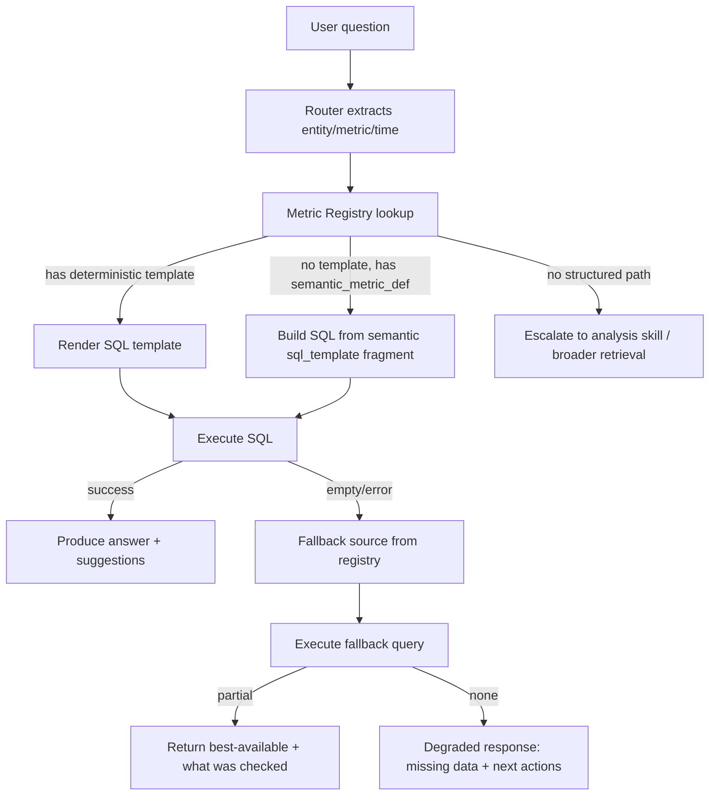

# Winston Canonical Metric Registry

## Executive summary

I used the GitHub connector for **paulmalmquist/Consulting_app** to extract Winston’s existing metric substrate from (a) the **live semantic catalog** schema and seed, (b) the **deterministic SQL template registry**, (c) the **metric normalizer** (static + DB-aware path), (d) the **skill registry** (routing hints), and (e) the **Meridian portfolio KPI SQL** used by the UI. The repo already contains the right primitives to make routing + SQL binding deterministic (semantic_metric_def + query templates), but the “wrong numbers / can’t break that out” issues you’re seeing come from missing **metric contracts** (grain/scope/time defaults, additivity rules, and canonical definitions) and from having multiple competing implementations (e.g., asset counts and loan fields). The attached JSON registry puts a single canonical contract in front of Winston, pointing each metric to a deterministic template when possible (fast/cheap/consistent), otherwise to semantic_metric_def fragments or service-level SQL, with explicit fallback sources and validation queries. fileciteturn130file0L1-L1 fileciteturn123file0L1-L1 fileciteturn124file0L1-L1 fileciteturn127file0L1-L1

### Top recommendations

1. **Adopt this registry as the single source of truth** for metric grain/scope/time/additivity, and make Winston consult it *before* dispatching to templates/tools—this prevents “break that out by fund” from asking for metric/time again because it can reuse the active metric contract. fileciteturn125file0L1-L1  
2. **Add 3 missing deterministic templates** to eliminate your highest-friction/latency queries:  
   - `repe.total_commitments_by_fund` (fixes the commitment breakout flow)  
   - `repe.nav_exposure_by_market` (fixes “exposure by NAV in Texas”)  
   - `repe.asset_counts` (unifies “active vs ever-held vs pipeline”)  
   The template system is explicitly intended to “skip the LLM entirely” when a template matches. fileciteturn124file0L1-L1  
3. **Unify asset-count definition** (the trust-breaker): `re_env_portfolio.get_portfolio_kpis()` currently counts *property* assets only and uses a specific status whitelist; the UI appears to use a different definition. Standardize on one definition in the registry and make both UI + Winston read it. fileciteturn127file0L1-L1  
4. **Fix loan schema drift**: the template file uses `re_loan.rate/maturity/upb`, while the portfolio code uses `interest_rate/maturity_date/loan_amount`. Pick one canonical schema (or create a canonical `re_loan_detail` view) and update templates + semantic joins accordingly. fileciteturn124file0L1-L1 fileciteturn127file0L1-L1  
5. **Bake metric validation + pgvector bootstrap into CI**: schema includes vector usage; pgvector requires `CREATE EXTENSION vector` per database. Use a pgvector-ready Postgres service image or install the package in CI, then verify the extension exists. citeturn2search0turn2search2  

## Canonical metric registry JSON

I generated a machine-usable JSON registry from the repo’s semantic catalog seed, query template registry, and Meridian KPI SQL.

**Download:** [winston_metric_registry.json](sandbox:/mnt/data/winston_metric_registry.json)

### JSON schema (what’s included)

Each metric entry includes:

- `metric_key`, `aliases`
- `canonical_sql_source` (file path + template key or service symbol)
- `grain`, `default_scope`, `time_behavior`
- `allowed_breakouts`, `unit`, `additivity`
- `fallback_source`, `routing_hint`
- `sample_query`, `seeded`, `confidence`

This aligns with how the repo already expects metric extraction to work: static synonyms + DB-based metric registry extraction (semantic_metric_def) fileciteturn125file0L1-L1, and DB-backed catalog queries via semantic_catalog.py fileciteturn132file0L1-L1 and semantic_runtime.py fileciteturn131file0L1-L1.

## Template and semantic catalog inventory

### Deterministic SQL templates found

These templates are the fastest, most reproducible path: the module explicitly states templates allow you to “skip the LLM entirely” for common business questions. fileciteturn124file0L1-L1

| Domain | Template key | Purpose (from template list) | File |
|---|---|---|---|
| REPE | `repe.noi_movers` | NOI change between two quarters | `backend/app/sql_agent/query_templates.py` fileciteturn124file0L1-L1 |
| REPE | `repe.noi_ranked` | Rank assets by NOI (latest or quarter) | same fileciteturn124file0L1-L1 |
| REPE | `repe.noi_trend` | NOI trend by quarter | same fileciteturn124file0L1-L1 |
| REPE | `repe.occupancy_trend` | Occupancy trend by quarter | same fileciteturn124file0L1-L1 |
| REPE | `repe.occupancy_ranked` | Rank assets by occupancy | same fileciteturn124file0L1-L1 |
| REPE | `repe.fund_returns` | Fund returns (IRR/TVPI/DPI/RVPI/NAV) by quarter | same fileciteturn124file0L1-L1 |
| REPE | `repe.irr_ranked` | Funds ranked by gross IRR | same fileciteturn124file0L1-L1 |
| REPE | `repe.tvpi_ranked` | Funds ranked by TVPI | same fileciteturn124file0L1-L1 |
| REPE | `repe.nav_ranked` | Funds ranked by NAV | same fileciteturn124file0L1-L1 |
| REPE | `repe.dscr_ranked` | Assets ranked by DSCR | same fileciteturn124file0L1-L1 |
| REPE | `repe.ltv_ranked` | Assets ranked by LTV | same fileciteturn124file0L1-L1 |
| REPE | `repe.debt_maturity` | Loans maturing within N months | same fileciteturn124file0L1-L1 |
| REPE | `repe.covenant_status` | Covenant compliance status | same fileciteturn124file0L1-L1 |
| REPE | `repe.loans_maturing` | Loans maturing within date range | same fileciteturn124file0L1-L1 |
| PDS | `pds.utilization_trend` | Utilization trend over time | same fileciteturn124file0L1-L1 |
| PDS | `pds.utilization_by_group` | Utilization by region/role | same fileciteturn124file0L1-L1 |
| PDS | `pds.revenue_variance` | Actual vs budget revenue by service line | same fileciteturn124file0L1-L1 |
| PDS | `pds.nps_summary` | NPS by account/quarter | same fileciteturn124file0L1-L1 |
| PDS | `pds.bench_report` | Employees on the bench | same fileciteturn124file0L1-L1 |
| PDS | `pds.tech_adoption` | Tech adoption over time | same fileciteturn124file0L1-L1 |
| CRM | `crm.stale_opportunities` | Opportunities stale > N days | same fileciteturn124file0L1-L1 |
| CRM | `crm.pipeline_summary` | Pipeline value by stage | same fileciteturn124file0L1-L1 |
| CRM | `crm.win_rate` | Win rate by period | same fileciteturn124file0L1-L1 |

### semantic_metric_def entries found

The semantic catalog schema defines `semantic_metric_def` as the governed metric registry table, including `metric_key`, `sql_template`, `unit`, and `aggregation`. fileciteturn130file0L1-L1  
The Meridian seed file inserts metric definitions for asset accounting line items, asset KPIs, fund return metrics, and several PDS metrics. fileciteturn123file0L1-L1

| Metric key (seed) | Display name | Entity | Unit / Aggregation | Source |
|---|---|---|---|---|
| `NOI`, `NOI_MARGIN` | Net Operating Income, NOI Margin | asset | dollar/sum, percent/avg | `repo-b/db/schema/341_semantic_catalog_seed.sql` fileciteturn123file0L1-L1 |
| `EGI`, `TOTAL_OPEX` | Effective Gross Income, Total Operating Expenses | asset | dollar/sum | same fileciteturn123file0L1-L1 |
| `OCCUPANCY`, `AVG_RENT` | Occupancy, Avg Rent / Unit | asset | percent/avg, dollar/avg | same fileciteturn123file0L1-L1 |
| `DSCR`, `DEBT_YIELD`, `LTV` | Debt Service Coverage, Debt Yield, Loan-to-Value | asset | ratio/avg, percent/avg, percent/avg | same fileciteturn123file0L1-L1 |
| `GROSS_IRR`, `NET_IRR`, `TVPI`, `DPI`, `RVPI` | Fund returns | fund | percent/latest, ratio/latest | same fileciteturn123file0L1-L1 |
| `PORTFOLIO_NAV`, `WEIGHTED_LTV`, `WEIGHTED_DSCR` | NAV + portfolio debt KPIs | fund | dollar/latest, ratio/latest | same fileciteturn123file0L1-L1 |
| `BUDGET_VARIANCE`, `CONTINGENCY_BURN`, `COMMITTED_PCT`, `CHANGE_ORDER_TOTAL` | Project KPIs | project | dollar/sum, percent/avg | same fileciteturn123file0L1-L1 |
| Income/cashflow line items (`RENT`, `CAPEX`, etc.) | Line-code definitions | asset | dollar/sum | same fileciteturn123file0L1-L1 |

## Skill-to-metric mapping

Winston’s skill registry defines the skill IDs you’re using for routing (e.g., `explain_metric`, `rank_metric`, `trend_metric`) plus the newer `fund_summary` and `fund_holdings`. fileciteturn126file0L1-L1  
Below is a pragmatic mapping of which metrics each skill should consider “supported” by default, aligned to the templates and catalog entries above.

| Skill | Supported metrics (default set) | Notes |
|---|---|---|
| `fund_summary` fileciteturn126file0L1-L1 | `fund_count`, `total_commitments`, `portfolio_nav_total`, `gross_irr_weighted`, `net_irr_weighted`, `active_assets_count` | Matches portfolio KPI panel logic in `re_env_portfolio.get_portfolio_kpis()` fileciteturn127file0L1-L1 |
| `fund_holdings` fileciteturn126file0L1-L1 | `noi`, `occupancy`, `nav`, `asset_value`, `ltv`, `dscr`, `debt_yield` | Needs stable “asset count” definition to avoid page mismatch fileciteturn127file0L1-L1 |
| `explain_metric` fileciteturn126file0L1-L1 | `noi`, `gross_irr`, `tvpi`, `dpi`, `rvpi`, `portfolio_nav`, `occupancy`, `ltv`, `dscr`, `budget_variance` | Metric normalizer extracts these via static synonyms + DB registry fileciteturn125file0L1-L1 |
| `rank_metric` fileciteturn126file0L1-L1 | `noi`, `occupancy`, `gross_irr`, `tvpi`, `portfolio_nav`, `dscr`, `ltv` | Only “high confidence” ranks should use deterministic templates fileciteturn124file0L1-L1 |
| `trend_metric` fileciteturn126file0L1-L1 | `noi`, `occupancy`, `portfolio_nav`, `win_rate_pct`, `utilization_pct` | Use `repe.noi_trend`, `repe.occupancy_trend`, `repe.fund_returns` where possible fileciteturn124file0L1-L1 |
| `explain_metric_variance` fileciteturn126file0L1-L1 | `noi_change`, `budget_variance`, `revenue_variance` | Deterministic `repe.noi_movers` exists fileciteturn124file0L1-L1 |
| `compare_entities` fileciteturn126file0L1-L1 | Same set as explain/rank, but requires entity list | Comparisons should prefer templates over agentic SQL |

## Verification checklist and test commands

### Database + catalog integrity

1. **Migrate schema**
```bash
make db:migrate
```

2. **Verify semantic catalog tables exist**  
`semantic_metric_def` is created by `340_semantic_catalog.sql`. fileciteturn130file0L1-L1

3. **Verify catalog seed inserted metric definitions**  
The seed inserts metrics into `semantic_metric_def` and entities into `semantic_entity_def`. fileciteturn123file0L1-L1
```bash
PGPASSWORD=postgres psql -h 127.0.0.1 -U postgres -d app -c \
"SELECT metric_key, unit, aggregation, entity_key
 FROM semantic_metric_def
 WHERE business_id='a1b2c3d4-0001-0001-0001-000000000001'
 ORDER BY metric_key;"
```

### Template-level validation (fast path)

The template engine is designed for deterministic, reproducible SQL execution. fileciteturn124file0L1-L1

```bash
python - <<'PY'
from app.sql_agent.query_templates import list_templates, render_template
for t in list_templates(domain="repe"):
    sql, params = render_template(t.key, {"business_id":"a1b2c3d4-0001-0001-0001-000000000001"})
    print(t.key, "ok", "required=", t.required_params)
PY
```

### Portfolio KPI spot checks (Meridian)

`get_portfolio_kpis()` is the canonical source (today) for `fund_count`, `total_commitments`, `portfolio_nav_total`, `active_assets_count`, and weighted IRRs. fileciteturn127file0L1-L1

```bash
python - <<'PY'
from uuid import UUID
from app.services.re_env_portfolio import get_portfolio_kpis
print(get_portfolio_kpis(
    env_id=UUID("a1b2c3d4-0000-0000-0000-000000000001"),
    business_id=UUID("a1b2c3d4-0001-0001-0001-000000000001"),
    quarter="2026Q2",
))
PY
```

### pgvector verification for CI/nightly (RAG stability)

pgvector requires enabling the extension per database: `CREATE EXTENSION vector;`. citeturn2search0  
For GitHub Actions on Ubuntu, pgvector provides an install step example using `apt-get install postgresql-16-pgvector`. citeturn2search2

```bash
PGPASSWORD=postgres psql -h 127.0.0.1 -U postgres -d app -c \
"CREATE EXTENSION IF NOT EXISTS vector;"
PGPASSWORD=postgres psql -h 127.0.0.1 -U postgres -d app -c \
"SELECT extname, extversion FROM pg_extension WHERE extname='vector';"
```

### Docker cache bloat checks (deploy stability)

Use Docker’s supported prune commands periodically on long-lived hosts (carefully). Docker documents `docker system prune` and related flags (including `--filter`). citeturn0search0turn0search1

```bash
docker system df
docker system prune -f --filter "until=168h"   # example: prune objects older than 7 days
```

## How Winston should use the registry



This aligns with the repo’s intent: (1) deterministic templates to bypass the LLM when possible fileciteturn124file0L1-L1, (2) DB-backed semantic metric extraction when the catalog exists fileciteturn131file0L1-L1, and (3) skill-level routing hints from the registry. fileciteturn126file0L1-L1

## Evidence appendix

Repo files used (GitHub connector):

- Semantic catalog schema: `repo-b/db/schema/340_semantic_catalog.sql` fileciteturn130file0L1-L1  
- Semantic catalog seed (entities, metrics, dimensions, joins, lineage): `repo-b/db/schema/341_semantic_catalog_seed.sql` fileciteturn123file0L1-L1  
- Deterministic SQL templates: `backend/app/sql_agent/query_templates.py` fileciteturn124file0L1-L1  
- Metric normalization (static synonyms + DB-aware extraction fallback): `backend/app/assistant_runtime/metric_normalizer.py` fileciteturn125file0L1-L1  
- Skill registry (routing hint targets): `backend/app/assistant_runtime/skill_registry.py` fileciteturn126file0L1-L1  
- Meridian KPI SQL (fund count, commitments, NAV total, active assets, weighted IRR): `backend/app/services/re_env_portfolio.py` fileciteturn127file0L1-L1  
- Semantic runtime wrapper (DB metric extraction behavior): `backend/app/services/semantic_runtime.py` fileciteturn131file0L1-L1  
- Catalog service accessors: `backend/app/services/semantic_catalog.py` fileciteturn132file0L1-L1  

External primary references:

- pgvector: enable with `CREATE EXTENSION vector` (per database). citeturn2search0  
- pgvector GitHub Actions install step example (`apt-get install postgresql-16-pgvector`). citeturn2search2  
- Docker prune commands (`docker system prune`, options, filters). citeturn0search0turn0search1  
- PostGIS image overview (PostGIS extensions included; pgvector is not part of those default extensions). citeturn1search1  
- Anthropic MCP overview (protocol for connecting tools/context). citeturn0search2