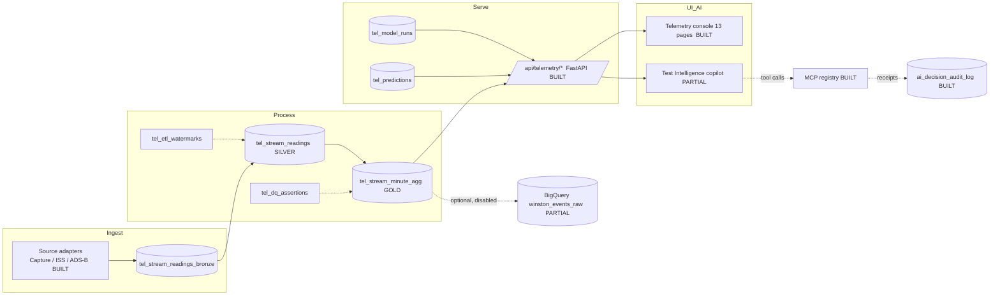
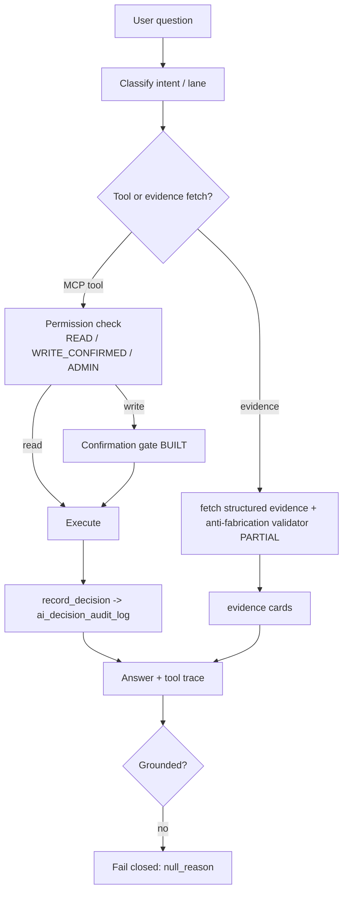
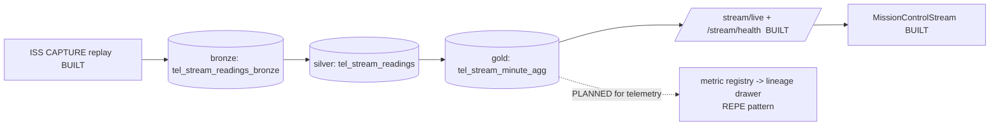
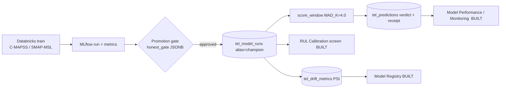
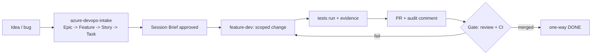
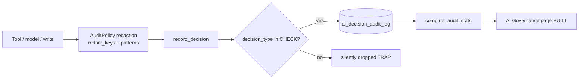
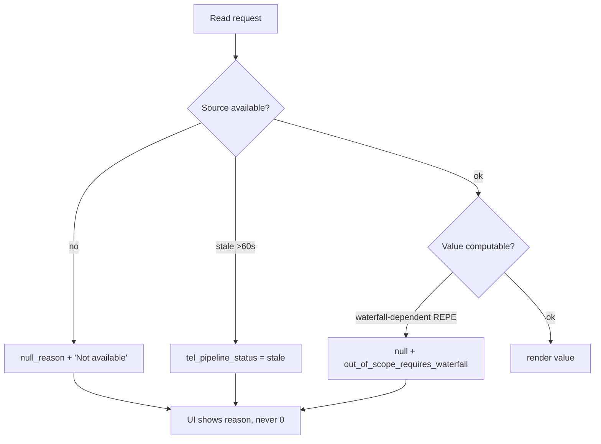

# RS Telemetry — architecture diagrams (Mermaid)

Honest status labels are in the node text (BUILT / PARTIAL / PLANNED). These mirror the in-app
`/telemetry/how-it-works` exhibit, which renders the same flows as a hand-rolled diagram (no mermaid
runtime in the app bundle).

## 1 · System architecture

## 2 · AI orchestration flow

## 3 · Medallion lineage (follow one stream aggregate)

## 4 · Model lifecycle

## 5 · Ticket → PR loop

The AI-generated-SQL + dry-run-cost step is PLANNED.

## 6 · Audit / receipt loop

## 7 · Fail-closed handling

