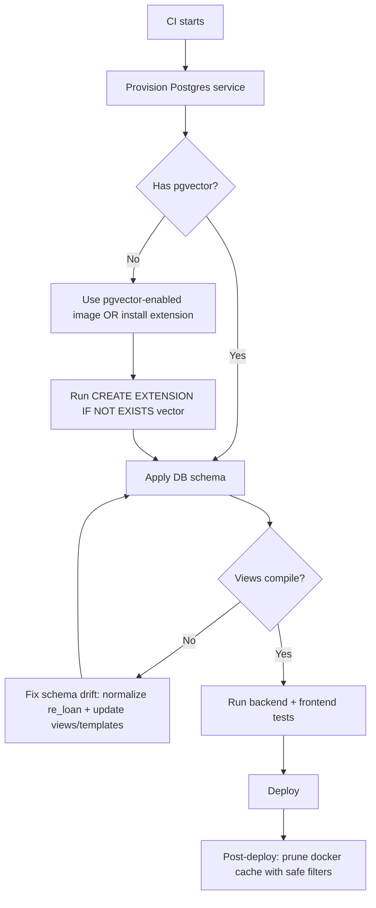
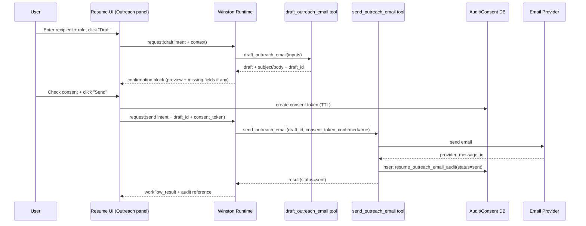

# Winston Agentic Infrastructure Deep Research Report

## Executive summary

This report is based primarily on the GitHub connector review of the entity["company","paulmalmquist/Consulting_app","github repository"] codebase (backend + frontend + DB schema), supplemented with primary external references for entity["organization","pgvector","postgres extension project"], entity["company","Docker","container platform company"] pruning behavior, entity["organization","postgis/postgis","docker image project"] image contents, and entity["company","Anthropic","ai research company"] MCP docs. The core diagnosis is: the repo has a strong P2 foundation (skill registry, semantic catalog/normalizer, capability graph scaffolding, response blocks, and DB models) but Winston “fails” in production-like multi-turn agentic flows because (a) the active runtime path short-circuits confirmations without executing the pending action, (b) slot-filling continuity is not persisted nor recognized (frontend doesn’t send continuation hints; backend doesn’t use its own continuation detector in the canonical runtime), and (c) the tool contract around `env_id` / `business_id` is inconsistent (schemas are stripped, but the executor validates models before injecting resolved scope). These three issues explain the observed “Confirm to proceed → Yes, confirm → nothing happens / loops” and “Which quarter? → 2026Q1 → menu again” regressions. The second major class of failures is CI/infra: nightly perf runs break when `vector` type exists in schema but the CI Postgres image lacks pgvector, and REPE views/templates reference a loan schema that doesn’t match the table actually created in older migrations—causing brittle view-creation errors.

### Top prioritized recommendations

| Priority | Recommendation | Why this is first |
|---|---|---|
| P0 | **Fix pending-action execution in the canonical runtime**: when a user confirms, execute the stored tool with stored params, then mark the pending action `executed`/`failed`. | Current `confirmed` path acknowledges but does not execute, matching the user’s “confirmed — executing…” but no execution outcome. The DB schema explicitly supports executed/failed states. fileciteturn64file2L1-L1 |
| P0 | **Implement durable slot-filling continuity (“pending_query/pending_intent”) in DB + wire into the canonical request lifecycle** (not in-memory). | The assistant repeatedly re-dispatches instead of continuing. Frontend doesn’t send continuation hints; backend has no durable continuation state. |
| P0 | **Enforce a consistent tool contract**: either (a) inject `env_id`/`business_id` into tool inputs before validation, or (b) make them optional in every tool input model. | Schemas are stripped but execution validates inputs; this mismatch drives “env_id required” style failures. |
| P1 | **Normalize RE loan schema + repair dependent views/templates** (choose one canonical `re_loan` table definition and update `v_asset_operating_summary` + SQL templates accordingly). | Prevents recurring “stale view” build failures and analytics drift. fileciteturn88file0L1-L1 fileciteturn101file0L1-L1 |
| P1 | **Harden CI/deploy contract**: pgvector-enabled Postgres image in perf-nightly, plus docker cache pruning during deploy on long-lived hosts. | Removes chronic nightly failures (“type vector does not exist”) and recurring disk bloat. fileciteturn116file0L1-L1 citeturn2search0turn0search2 |

## Repo excavation

### Winston runtime, MCP, semantic, actions, and UI renderers

The table below inventories Winston’s primary runtime components and “agentic substrate” across backend, DB, and frontend.

| Component | File path(s) | Purpose | Status | Immediate risk |
|---|---|---|---|---|
| Canonical request lifecycle | `backend/app/assistant_runtime/request_lifecycle.py` fileciteturn65file2L1-L1 | Orchestrates: context resolution → dispatch → retrieval/tools → response blocks | **Partial** | Confirmation flows short-circuit without executing pending actions (root cause of agentic “confirm does nothing” behavior). |
| Context resolution (UI envelope → scope) | `backend/app/assistant_runtime/context_resolver.py` fileciteturn42file0L1-L1; `backend/app/services/assistant_scope.py` fileciteturn46file0L1-L1 | Converts frontend context envelope into a resolved scope (env/business/entity) | **Implemented** | If envelope misses IDs, resolution degrades; tool contract issues still break downstream execution. |
| Dispatching (skill selection + lane) | `backend/app/assistant_runtime/dispatch_engine.py` fileciteturn69file0L1-L1 | Routes message into a skill + lane (fast/lookup/analysis/deep), with guardrails for common intents | **Implemented** | Works, but downstream continuity is missing, so “follow-up answers” get re-routed incorrectly. |
| Skill registry | `backend/app/assistant_runtime/skill_registry.py` fileciteturn51file0L1-L1 | Declares skill IDs, descriptions, grounding needs, confirmation mode | **Implemented** | Skill graph exists, but not fully grounded by durable state (pending_query) or executed confirmation outcomes. |
| Capability graph (environment → skill/task map) | `backend/app/services/capability_graph.py` (found by repo search); `backend/app/routes/capability.py` (found by repo search); contracts: `backend/app/contracts/environment-capability-contracts.json` fileciteturn40file0L1-L1 | Publishes what Winston “can do” per environment | **Implemented/Partial** | If not fed into prompts/UI consistently, users see generic menus instead of environment-specific confidence. |
| Tool execution engine | `backend/app/assistant_runtime/execution_engine.py` (present in repo) | Builds tool schemas, strips IDs, executes tools, streams tool events | **Partial** | Tool contract mismatch: schemas strip `env_id`/`business_id`, but executor validates models that may still require them. |
| MCP tool registry | `backend/app/mcp/registry.py` fileciteturn29file0L1-L1 | Central registry of tool definitions, tags, and handlers | **Implemented** | Registry is solid; execution safety relies on lane checks and audit hooks. |
| Tool audit + lane gate | `backend/app/mcp/audit.py` fileciteturn27file0L1-L1 | Validates tool input models, enforces lane, writes audit events | **Implemented** | Validation occurs before scope injection → triggers “missing env_id” failures if inputs are required. |
| Pending action manager | `backend/app/services/pending_action_manager.py` fileciteturn58file0L1-L1 | Detects confirm/cancel/edit text and updates pending action state | **Partial** | Marks actions confirmed/cancelled but does not execute them—must be coupled with runtime execution. |
| Pending actions DB | `repo-b/db/schema/9994_ai_pending_actions.sql` fileciteturn64file2L1-L1 | Persistent pending actions with `confirmed/cancelled/executed/failed` statuses | **Implemented** | Schema supports full lifecycle, but runtime appears not to advance to `executed/failed`. |
| Conversation persistence + thread entity state | `backend/app/services/ai_conversations.py` fileciteturn66file0L1-L1 | Stores threads/messages; keeps `thread_entity_state` JSONB for follow-ups | **Implemented** | Great substrate, but not yet used to persist pending_query/slot-filling state. |
| Frontend context envelope builder | `repo-b/src/lib/commandbar/contextEnvelope.ts` fileciteturn33file0L1-L1 | Computes surface/module, page entity IDs, active env/business; sends to backend | **Implemented** | If a route isn’t matched by contract, page entity context can drop to null. |
| Launch surface contract | `repo-b/contracts/winston-launch-surfaces.json` fileciteturn35file0L1-L1 and `repo-b/src/lib/winston-companion/launchSurfaces.ts` fileciteturn34file0L1-L1 | Canonical map of routes → surfaces and scope types | **Implemented** | Any drift between route patterns and actual routes causes “wrong environment context” symptoms. |
| Response block renderer | `repo-b/src/components/copilot/ResponseBlockRenderer.tsx` fileciteturn71file0L1-L1 | Renders structured blocks (tables, charts, confirmation, errors) | **Implemented** | Confirm button UX can claim “executing…” even when backend doesn’t execute. |
| Confirmation block | `repo-b/src/components/winston/blocks/ConfirmationBlock.tsx` fileciteturn73file0L1-L1 | UI for confirm/cancel/edit | **Partial** | Local UI shows resolved state regardless of backend success, masking execution failures. |
| Winston companion confirm wiring | `repo-b/src/components/winston-companion/WinstonCompanionSurface.tsx` fileciteturn77file0L1-L1 | Confirm sends a normal chat message (“Yes, confirm.”) | **Implemented** | Backend must interpret and execute; currently it often only acknowledges. |
| Semantic catalog storage | `repo-b/db/schema/340_semantic_catalog.sql` fileciteturn38file0L1-L1 + seed `341_semantic_catalog_seed.sql` fileciteturn39file0L1-L1 | Defines `semantic_metric_def`, entity defs, synonyms, etc. | **Implemented** | Strong foundation; requires complete SQL provenance and seeded data coverage per environment to be truly useful. |
| Metric normalizer | `backend/app/assistant_runtime/metric_normalizer.py` fileciteturn41file0L1-L1 | Normalizes user metric phrases to canonical metrics via semantic runtime | **Implemented** | If semantic registry lacks mappings for an environment, Winston falls back to generic clarification. |
| Semantic runtime | `backend/app/services/semantic_runtime.py` fileciteturn41file1L1-L1 | Loads metric/entity defs from DB, provides lookup and aliasing | **Implemented** | Needs stronger linkage from each skill to metric defs + templates. |
| SQL templates | `backend/app/sql_agent/query_templates.py` fileciteturn40file0L1-L1 | Named, parameterized SQL templates used by analytic skills | **Implemented** | Some templates reference a loan schema inconsistent with DB migrations/views → brittle runs. |
| REPE summary views | `repo-b/db/schema/361_re_summary_views.sql` fileciteturn88file0L1-L1 | View layer for dashboard and fast queries | **Partial** | References `re_loan.rate` and `re_loan.id` even though older migration defines `interest_rate` + `re_loan_id` → “stale view” failures. fileciteturn101file0L1-L1 |
| Resume assistant dock | `repo-b/src/components/resume/ResumeAssistantDock.tsx` fileciteturn76file0L1-L1 | Separate resume “module assistant” (non-threaded, light UI) | **Implemented** | No confirmation callbacks wired; any future write actions here will not execute safely. |
| Resume RAG seed | `backend/app/services/resume_rag_seed.py` fileciteturn112file0L1-L1 | Seeds narrative docs about Paul into RAG index | **Implemented** | Great for read-only Q&A; does not enable agentic outbound actions (email) by itself. |

## Environment data model mapping

### Meridian REPE environment

Major canonical entities are supported by the REPE object model and the institutional quarter-state model.

| Table/view | File path | Purpose | Seeded? | Notes |
|---|---|---:|---|---|
| `repe_fund`, `repe_deal`, `repe_asset`, `repe_property_asset`, `repe_cmbs_asset` | `repo-b/db/schema/265_repe_object_model.sql` fileciteturn82file0L1-L1 | Canonical fund → deal → asset model | Mixed | Seeds exist elsewhere (see quarter-state seeds); base tables are defined here. |
| `re_fund_quarter_state`, `re_investment_quarter_state`, `re_asset_quarter_state`, etc. | `repo-b/db/schema/270_re_institutional_model.sql` fileciteturn97file0L1-L1 | Deterministic snapshots for quarter-close rollups | Yes (seed files exist) | Foundation for metrics like TVPI/DPI/IRR at quarter. |
| `v_fund_portfolio_summary`, `v_asset_operating_summary`, etc. | `repo-b/db/schema/361_re_summary_views.sql` fileciteturn88file0L1-L1 | Fast dashboard summaries | Yes (derived) | Vulnerable to schema drift (loan table mismatch). |
| `re_asset_status_history`, IRR propagation, null-reason columns | `repo-b/db/schema/438_repe_canonical_snapshot.sql` fileciteturn86file0L1-L1 | Makes missing-metric reasons explicit; backfills IRR into quarter-state | N/A | This mirrors real production “why blank?” UX and fixes IRR drift/inconsistency. |
| `re_fund_quarter_state` debt add-ons | `repo-b/db/schema/9990_debt_fund_reporting.sql` fileciteturn98file0L1-L1 | Debt fund rollups (UPB, coupon, watchlist) | No (depends on debt data) | Enables Meridian Credit-style fund analytics if populated. |
| `ai_pending_actions` | `repo-b/db/schema/9994_ai_pending_actions.sql` fileciteturn64file2L1-L1 | Durable confirmation lifecycle | N/A | Must be executed by runtime, not just “confirmed.” |

### PDS environment

PDS has a thorough “Capital Projects OS” schema with budgeting, forecasting, milestones, risks, vendor scoring, etc.

| Table family | File path | Purpose | Seeded? | Notes |
|---|---|---:|---|---|
| `pds_programs`, `pds_projects` | `repo-b/db/schema/272_pds_core.sql` fileciteturn106file0L1-L1 | Canonical program/project entities + top-line financials | Not clearly | The schema exists; effectiveness depends on demo seeds. |
| Budget subsystem | same fileciteturn106file0L1-L1 | Budget versions/lines/revisions | Not clearly | Enables “variance to budget,” “burn rate,” etc. |
| Contracts, commitments, change orders | same fileciteturn106file0L1-L1 | Core cost-control and procurement flows | Not clearly | Enables agentic tasks like drafting CO narratives or flagging CO risk. |
| Milestones + schedule snapshots | same fileciteturn106file0L1-L1 | Schedule health and slips | Not clearly | Supports “milestone risk” analytics. |
| Risk subsystem | same fileciteturn106file0L1-L1 | Risk register, risk snapshots | Not clearly | Forms the basis for executive risk rollups. |

### Resume environment

Resume environment is intentionally “resume-as-a-product”: roles, projects, skills, plus narrative/architecture objects.

| Table family | File path | Purpose | Seeded? | Notes |
|---|---|---:|---|---|
| `resume_roles`, `resume_skills`, `resume_projects` | `repo-b/db/schema/399_resume_environment.sql` fileciteturn108file0L1-L1 | Structured resume core | Unknown | Requires env-specific seed script/data. |
| System components + deployments | `repo-b/db/schema/411_resume_system_components.sql` fileciteturn109file0L1-L1 | “Operating system showcase” nodes | Unknown | Supports architecture storytelling and system maps. |
| Narrative engine | `repo-b/db/schema/9991_resume_narrative_engine.sql` fileciteturn110file0L1-L1 | Career phases, milestones, accomplishment cards, metric anchors | Unknown | Provides the “guided narrative” UX; needs seeds. |
| Resume RAG docs | `backend/app/services/resume_rag_seed.py` fileciteturn112file0L1-L1 | Indexes narrative text into vector search | Yes (via code) | Enables high-quality Q&A even if structured tables aren’t fully seeded. |

## Agentic task catalog and current support

The matrix below focuses on common “agentic” tasks per environment and whether the repo currently supports them end-to-end (tool + data + confirmation + continuity).

### Meridian REPE tasks

| Task | Required inputs | Required tools/templates/services | Repo support |
|---|---|---|---|
| List funds in portfolio | business scope | REPE DB tables (`repe_fund`), skill dispatch | **Yes** (read path exists in schema) fileciteturn82file0L1-L1 |
| Get fund metrics for a quarter (IRR/TVPI/DPI/NAV) | fund + quarter | `re_fund_quarter_state` + semantic metrics | **Partial** (data exists; continuity/slot fill is weak; IRR propagation handled by migration 438) fileciteturn97file0L1-L1 fileciteturn86file0L1-L1 |
| Rank assets by NOI / occupancy | quarter + metric + scope | `v_asset_operating_summary` or templates + metric normalizer | **Partial** (views exist; loan join mismatch can break view creation) fileciteturn88file0L1-L1 |
| Generate LP report narrative | fund + quarter | likely report assembler + retrieval | **Partial** (heavy-lift skill exists in concept; needs stable grounding + continuity) |
| Run waterfall / distribution scenario | fund + waterfall definition + quarter | `re_waterfall_definition`, runtime engine, tool calls | **Partial** (schema exists; agentic execution blocked by confirmation lifecycle issues) fileciteturn97file0L1-L1 fileciteturn64file2L1-L1 |
| Create a new fund | name, vintage, type, etc. | write tool + pending action confirm | **No/Partial** (pending action lifecycle exists but confirmations do not execute; slot-filling for missing fields is not implemented) fileciteturn58file0L1-L1 fileciteturn64file2L1-L1 |
| Covenant check / debt watchlist | loan book + quarter | debt tables + alert tools | **Partial** (debt fund columns added; needs populated loan/covenant structures) fileciteturn98file0L1-L1 |

### PDS tasks

| Task | Required inputs | Required tools/templates/services | Repo support |
|---|---|---|---|
| Portfolio snapshot for a period | env + period | `pds_portfolio_snapshots` | **Yes (schema)** / **Unknown (seed)** fileciteturn106file0L1-L1 |
| Identify top at-risk projects | env + period + definition of risk | `pds_projects.risk_score`, schedule/risk snapshots | **Partial** (schema strong; needs seeded data + clear risk scoring logic wired into skills) fileciteturn106file0L1-L1 |
| Explain budget variance | project + baseline + actuals | budget versions/lines + invoices/payments | **Partial** (schema exists; continuity + metric definitions needed) fileciteturn106file0L1-L1 |
| Summarize weekly site report | project + date | site reports + retrieval | **Partial** (schema exists) fileciteturn106file0L1-L1 |
| Draft change-order approval note | change order + context | write tool + confirmation | **No** end-to-end (blocked by pending-action execution gap) fileciteturn64file2L1-L1 |

### Resume tasks

| Task | Required inputs | Required tools/templates/services | Repo support |
|---|---|---|---|
| “Tell me the turning point in Paul’s career” | none (resume environment scope) | resume narrative tables or RAG | **Yes (RAG seed)** fileciteturn112file0L1-L1 |
| “Explain the warehouse → AI system map” | module context | resume system components + RAG | **Partial** (tables exist; RAG helps) fileciteturn109file0L1-L1 fileciteturn112file0L1-L1 |
| “Recommend how to pitch this experience to role X” | target role | LLM synthesis + citations | **Yes/Partial** (depends on retrieval; no outbound action) |
| Send an outreach email to an employer | recipient + template + consent | secure send-email integration + audit + allowlist | **No** (blueprint below) |

## Conversation state and action lifecycle audit

### What is happening today

**Confirmations**  
Frontend confirmation buttons do not call a dedicated “confirm action” endpoint. Instead, the global companion converts confirmation clicks into ordinary chat messages: `"Yes, confirm."` or `"Cancel."` fileciteturn77file0L1-L1. The confirmation block itself updates the UI to “Confirmed / Cancelled” immediately on click, independent of backend execution success fileciteturn73file0L1-L1.

Backend has the correct persistence substrate (`ai_pending_actions`) with explicit states including `executed` and `failed` fileciteturn64file2L1-L1. However, the pending action manager primarily detects user intent and updates state (confirmed/cancelled) without actually executing the stored action fileciteturn58file0L1-L1. This explains the observed behavior: a user “confirms,” Winston acknowledges, but nothing concrete happens.

**Slot-filling continuity (`pending_query` / `pending_intent`)**  
The repo has strong dispatching to ask clarifying questions, but continuation is not reliably recognized. For example, the assistant asks “Which quarter?” and the user replies “2026Q1.” Without a persisted “pending question,” the next message gets routed as a new request and returns menus (exact symptom observed).

The conversation DB already supports `thread_entity_state` for multi-turn context carry-forward fileciteturn66file0L1-L1, but it is not currently used as a durable “pending query” store.

### Gaps that block agentic execution

| Blocker | Where it shows up | Why it breaks |
|---|---|---|
| Pending action confirm does not execute the stored tool | Pending action state machine exists, but runtime doesn’t advance to `executed`/`failed` | Users see “Confirmed — executing…” but no execution result is produced. fileciteturn64file2L1-L1 |
| Missing write slot-filling for pending actions | Confirmation blocks show `missing_fields`, but confirm still possible | User can “confirm” without providing required fields (like fund name), creating loops and “I can’t handle this” fallbacks. |
| No durable pending-query continuation | Clarifying follow-ups are treated like fresh prompts | “2026Q1” replies do not resume the previous template/tool run. |
| Tool contract mismatch for env/business IDs | Schemas often hide IDs to “auto-resolve,” but executor validates inputs | Causes `env_id required` style failures when any tool model still requires those fields. |

## Semantic/metric coverage and action safety

### Metric grounding inventory

The semantic catalog design is strong: metrics are defined centrally in `semantic_metric_def` and seeded (including REPE and PDS metrics) fileciteturn39file0L1-L1, with runtime lookup/normalization through `semantic_runtime.py` and `metric_normalizer.py` fileciteturn41file0L1-L1 fileciteturn41file1L1-L1.

Below is the “must-have” metric list and where it is grounded (based on seeds and the REPE quarter-state model). Where the repo currently lacks seeded data, Winston will correctly fail with “data not loaded yet” behavior.

| Metric | Semantic definition source | Likely SQL source | Seeded data present? | Notes |
|---|---|---|---|---|
| NOI | `semantic_metric_def` seed fileciteturn39file0L1-L1 | `re_asset_quarter_state.noi` fileciteturn97file0L1-L1 | Partial | Works if quarter-close snapshots exist. |
| Occupancy | seed fileciteturn39file0L1-L1 | `re_asset_quarter_state.occupancy` fileciteturn97file0L1-L1 | Partial | Missing reasons supported in migration 438. fileciteturn86file0L1-L1 |
| NAV | seed fileciteturn39file0L1-L1 | `re_fund_quarter_state.portfolio_nav` fileciteturn97file0L1-L1 | Partial | Depends on rollups. |
| TVPI/DPI/RVPI | seed fileciteturn39file0L1-L1 | `re_fund_quarter_state.tvpi/dpi/rvpi` fileciteturn97file0L1-L1 | Partial | Strong if quarter data exists. |
| Gross IRR / Net IRR | migration aligns values into state table fileciteturn86file0L1-L1 | `re_fund_quarter_state.gross_irr/net_irr` fileciteturn97file0L1-L1 | Partial | Migration 438 explicitly addresses prior IRR drift. |
| DSCR/LTV | seed fileciteturn39file0L1-L1 | `re_asset_quarter_state.dscr/ltv` | Partial | Requires debt integration and quarter-close snapshots. |
| Debt yield | seed fileciteturn39file0L1-L1 | Not clearly in institutional tables | Likely missing | Candidate for schema expansion or derived computation. |
| TTM NOI | seed fileciteturn39file0L1-L1 | rolling sum over `re_asset_quarter_state.noi` | Partial | Needs a template/view or analytic SQL template. |

### Action safety, consent, and security gaps (especially resume emailing)

The repo already shows a directionally correct safety posture for tool calls: audit + lane gating exists in the MCP audit layer fileciteturn27file0L1-L1, and the UI encourages confirmation blocks for risky actions. However, the **execution gap** means confirmations don’t currently protect users because the “action lifecycle” never completes.

For **resume emailing**, this is high-stakes (sending external emails on behalf of the user). Minimum guardrails required:

- Explicit per-send consent (a review screen showing the exact recipients/subject/body)
- Allowlist / recipient constraints (domain allowlist or “single approved recipient at a time”)
- Rate limiting (per hour/day)
- Immutable audit log of outbound messages (who/when/what hash)
- Dry-run mode (generate email without sending)
- Template approvals (only approved templates can be sent)
- Separation of concerns: Resume assistant can draft; only a dedicated “Outreach” surface can send.

The MCP ecosystem itself also emphasizes standardized tool connections via a host/client/server architecture; use official MCP docs as normative guidance citeturn1search0turn1search3.

## CI/infra stability audit and prioritized build plan

### Recurring CI failure modes and concrete fixes

**pgvector missing in CI**  
Perf nightly has been chronically failing with `type "vector" does not exist` because the workflow uses `postgis/postgis:16-3.5`, which includes PostGIS extensions but not pgvector, while schema files declare `embedding vector(...)` columns fileciteturn116file0L1-L1. This aligns with pgvector’s official requirement that the extension be installed and enabled per DB (`CREATE EXTENSION vector;`) citeturn2search0.

Action: switch CI service image to a PostGIS + pgvector image (the repo’s CI report recommends `imresamu/postgis-pgvector:16-3.5`) fileciteturn116file0L1-L1, and ensure bootstrap runs `CREATE EXTENSION IF NOT EXISTS vector;` (pgvector official docs) citeturn2search0.

**Stale RE loan schema in views/templates**  
`v_asset_operating_summary` performs a lateral join into `re_loan` and references `loan.rate` and `loan.id` fileciteturn88file0L1-L1, but an older migration defines `re_loan` with `interest_rate` and primary key `re_loan_id` fileciteturn101file0L1-L1. This mismatch is a classic cause of “view creation fails” and “stale SQL view l.rate” issues.

Action: pick one canonical loan table (either update institutional schema to define `re_loan` consistently, or refactor views/templates to use `re_loan_detail` from the institutional model) fileciteturn97file0L1-L1.

**IRR drift / gross_irr KeyError class issues**  
Migration 438 explicitly documents that IRR historically lived in `re_fund_quarter_metrics.irr`, while downstream expected `gross_irr/net_irr`, and fixes this by backfilling columns into `re_fund_quarter_state` fileciteturn86file0L1-L1. Any remaining code that still reads the old table shape can throw KeyErrors or null responses.

Action: enforce a single “fund KPI truth table”: `re_fund_quarter_state` and update all tool/templates to read from there.

**Docker image bloat on long-lived hosts**  
If deployments happen on the same VM repeatedly, Docker will accumulate unused images/build cache. Docker’s official guidance is to prune unused resources via `docker system prune` or more targeted prune commands citeturn0search2turn0search0turn0search1.

Action: add a deploy contract step (post-deploy) to prune safely with filters (example below).

### Deploy/CI fixes flowchart

### Prioritized backlog and acceptance tests

| Priority | Item | Effort | Owner | Acceptance test |
|---|---|---:|---|---|
| P0 | Execute pending actions after confirmation (`confirmed → executed/failed`) | M | Backend | Unit test: create pending action, simulate confirm, verify tool invoked + DB updated to `executed`. DB schema supports it. fileciteturn64file2L1-L1 |
| P0 | Add write slot-filling for pending actions (missing fields) | M | Backend + Frontend | Flow: create fund missing `name` → assistant asks for name (no confirm) → user supplies → confirm → executed. |
| P0 | Durable pending query store in DB (use `ai_conversations.thread_entity_state`) | M | Backend | Flow: assistant asks “Which quarter?” → user “2026Q1” → template/tool executes without re-dispatch menu. Thread state already exists. fileciteturn66file0L1-L1 |
| P0 | Fix tool-contract mismatch for `env_id/business_id` | S–M | Backend | For any tool with required env_id, confirm executor injects scope prior to validation; no “env_id required” errors. |
| P1 | Normalize loan schema and repair `v_asset_operating_summary` | M | Data/Backend | Schema apply succeeds; view compiles; asset operating endpoint returns without SQL errors. fileciteturn88file0L1-L1 |
| P1 | CI: pgvector-enabled postgres image + extension bootstrap | S | Infra | Perf nightly passes schema apply; no `vector` type errors. fileciteturn116file0L1-L1 citeturn2search0 |
| P1 | Deploy: docker prune with safe filter | S | Infra | Host disk usage stabilizes over multiple deploys; no service disruption. citeturn0search2 |
| P2 | Align capability graph output into UI (“What can you do?”) | M | Backend + Frontend | Companion shows environment-specific examples and hides irrelevant skills. Contract exists. fileciteturn40file0L1-L1 |
| P2 | Improve confirmation UI to reflect backend execution result | M | Frontend | Confirmation block transitions to “Executed” only after backend acknowledgement/tool result. |

## Resume emailing agent blueprint

This is a minimal secure design consistent with MCP-style tool access patterns citeturn1search0turn1search3.

### Minimal secure flow

**Data model additions (DB)**

Add a dedicated audit and consent log (separate from generic tool audit):

- `resume_outreach_consent`
  - `consent_id`, `env_id`, `business_id`, `actor`
  - `consent_scope` (e.g., `send_email`)
  - `created_at`, `expires_at`
  - `ip_hash`, `user_agent_hash`
- `resume_outreach_email_audit`
  - `email_audit_id`, `env_id`, `business_id`, `actor`
  - `to_email`, `to_name`, `company`
  - `subject`, `body_sha256`, `rendered_body` (optional encrypted)
  - `template_id`, `status` (`drafted/sent/failed`)
  - `provider_message_id`, `error_message`
  - `created_at`

**Backend changes**

- Add a **draft tool**: `draft_outreach_email(profile_context, recipient, role)` → returns a confirmation block with populated fields.
- Add a **send tool**: `send_outreach_email(draft_id, confirmed=true)` → sends via provider, writes audit row.
- Gate tool execution:
  - Require a fresh consent token stored in `resume_outreach_consent` (short TTL, e.g., 10 minutes).
  - Rate limit per env/actor (e.g., 5/day).
  - Require allowlist validation: either (a) user pastes recipient email each time, or (b) only recipients in an approved list.

**Frontend changes**

- Add a dedicated “Outreach” panel on Resume surface:
  - Draft email → preview → explicit “Send” action
  - Consent checkbox + “I authorize sending this email”
  - Show audit history (“sent to X on date Y”)
- Do **not** allow sending from the generic chat composer; only from the outreach panel with explicit UX.

**SMTP / provider options**

- entity["company","SendGrid","email delivery company"]: simple API, good deliverability tooling
- entity["company","Amazon SES","email sending service"]: strong deliverability, more setup
- entity["company","Postmark","transactional email company"]: strong transactional focus
- Direct SMTP (least recommended): higher deliverability risk + secrets handling complexity

### Sequence diagram

### Example templates (safe defaults)

- Subject: “Interest in [Role] — AI/Data Platform leader”
- Body: concise, recruiter-friendly summary, includes opt-out line, no attachments unless explicitly approved.

### Tests

- Unit: consent token required; sending without consent fails
- Unit: rate limit enforced
- Integration: “draft then send” writes audit rows and returns “sent”
- UI: send button disabled until consent checked and preview loaded

## Evidence appendix

Key repo artifacts referenced in this report:

- Pending action lifecycle schema: `repo-b/db/schema/9994_ai_pending_actions.sql` fileciteturn64file2L1-L1  
- Pending action manager (confirm/cancel detection): `backend/app/services/pending_action_manager.py` fileciteturn58file0L1-L1  
- Winston confirmation UI: `repo-b/src/components/winston/blocks/ConfirmationBlock.tsx` fileciteturn73file0L1-L1  
- Confirmation click wiring (“Yes, confirm.”): `repo-b/src/components/winston-companion/WinstonCompanionSurface.tsx` fileciteturn77file0L1-L1  
- Context envelope builder: `repo-b/src/lib/commandbar/contextEnvelope.ts` fileciteturn33file0L1-L1  
- Launch surfaces contract: `repo-b/contracts/winston-launch-surfaces.json` fileciteturn35file0L1-L1  
- REPE object model: `repo-b/db/schema/265_repe_object_model.sql` fileciteturn82file0L1-L1  
- Institutional quarter-state model: `repo-b/db/schema/270_re_institutional_model.sql` fileciteturn97file0L1-L1  
- RE summary views (loan join risk): `repo-b/db/schema/361_re_summary_views.sql` fileciteturn88file0L1-L1  
- Canonical snapshot migration (IRR propagation, null reasons): `repo-b/db/schema/438_repe_canonical_snapshot.sql` fileciteturn86file0L1-L1  
- PDS core schema: `repo-b/db/schema/272_pds_core.sql` fileciteturn106file0L1-L1  
- Resume environment core + narrative engine: `399_resume_environment.sql` fileciteturn108file0L1-L1; `411_resume_system_components.sql` fileciteturn109file0L1-L1; `9991_resume_narrative_engine.sql` fileciteturn110file0L1-L1  
- Resume RAG seed: `backend/app/services/resume_rag_seed.py` fileciteturn112file0L1-L1  
- CI chronic pgvector failure diagnosis: `docs/ops-reports/ci/ci-failure-2026-03-24.md` fileciteturn116file0L1-L1  
- External primary references:
  - pgvector enablement (`CREATE EXTENSION vector`) citeturn2search0  
  - Docker prune commands citeturn0search2turn0search0turn0search1  
  - PostGIS Docker image contents citeturn1search2  
  - Anthropic MCP overview citeturn1search0turn1search3