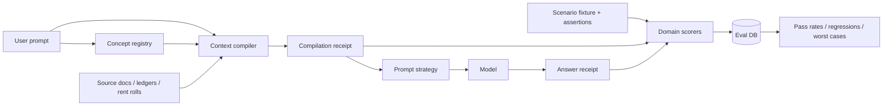
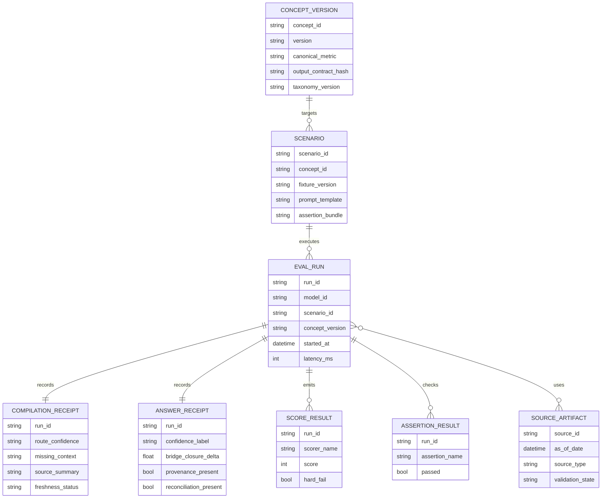

# REPE Reporting Language and Eval Design for NOI Variance

## Executive summary

There is no single universal REPE reporting standard that every operator, asset manager, lender, and fund manager uses in exactly the same way. Instead, industry practice converges around a small number of standard-setting bodies and templates for non-listed real estate and private funds, lender underwriting and appraisal rules, and public REIT supplemental reporting. The practical consequence is important for your architecture: a concept object cannot just know the name of a metric such as NOI; it must also know the metric’s **scope**, **basis**, **comparison set**, **pool rules**, and **provenance/freshness rules**. That is especially true for same-property or same-store NOI, where public industry materials explicitly note a wide range of definitions and the need to describe what is “in the pool and what is not.” citeturn18view4turn18view5turn12view4turn39view0

For NOI variance specifically, the most reusable operator language is short, bridge-oriented, and tied to a reporting basis. Public operator examples break same-store revenue into items such as lease rates, concessions, vacancy, bad debt, and “other”; explain NOI changes through contractual rent steps, renewal spreads, leasing activity, occupancy, and concessions; and distinguish cash vs. straight-line GAAP presentation. Lender guidance adds a complementary underwriting discipline: vacancy and collection loss must be analyzed explicitly, one-time income should be excluded, T-12 behavior matters, and material variances require explanation rather than hand-waving. citeturn31search7turn24view0turn26view2turn22view3turn22view4turn40view1turn40view2

The best v1 concept object for `noi_variance` therefore has six non-negotiable components: a canonical metric definition; basis and scope rules; a driver taxonomy; timing-versus-recurring classification; provenance and freshness policy; and a strict output contract that requires both the numeric answer and the reasoning path that closes back to the source numbers. That conclusion is an engineering inference, but it follows directly from the standards emphasis on comparability, transparency, reconciliation, detailed cash-flow support, and explicit disclosure policies. citeturn18view4turn18view5turn18view0turn19view0turn22view1turn23view2

The eval loop should mirror that structure. In practice, the most useful scorers are not generic “good answer / bad answer” checks; they are domain-aware checks for route correctness, context completeness, basis fidelity, arithmetic closure, driver attribution quality, recurring-versus-timing classification, stale or conflicting-source handling, provenance completeness, unsupported-claim detection, and concise operator-style narrative. If you implement those scorers first, you will get a harness that is good enough to stabilize reporting concepts beyond NOI variance without rebuilding the architecture every time. citeturn18view0turn18view1turn18view6turn22view1turn23view0turn41view0

## Source base and design principles

The highest-value source base for this work is the combination of:  
- entity["organization","INREV","non-listed real estate"] reporting guidance, data-delivery guidance, SDDS, and global definitions for operating, leverage, valuation, and performance terminology. citeturn12view3turn12view1turn12view4turn14view0turn14view1turn14view6turn15view2turn15view3turn15view6turn15view7  
- entity["organization","NCREIF","fiduciaries council"] and entity["organization","PREA","pension real estate"] Reporting Standards for transparency, consistency, and informed decision-making in private institutional real estate. citeturn12view2turn18view5  
- entity["organization","ILPA","lp association"] quarterly reporting standards, principles, DDQ, and glossary for reconciliation, performance metrics, diligence templates, and technology / third-party auditability. citeturn12view5turn18view0turn19view0turn23view3turn33view0turn35view0turn36view1  
- entity["company","Freddie Mac","multifamily finance"] appraisal, glossary, and desk-reference guidance for vacancy, concessions, collection loss, reserves, source identification, and underwriting explainability. citeturn12view6turn22view3turn22view4turn22view0turn23view1turn23view2  
- entity["company","Fannie Mae","multifamily finance"] multifamily guide rules for T-12, trailing 3/6/12 decline checks, exclusion of one-time non-recurring other income, EGI construction, and underwritten NCF discipline. citeturn40view0turn40view1turn40view2turn40view3turn41view0  
- entity["organization","Nareit","reit association"] materials for FFO, EBITDAre, NOI conventions, and the explicit observation that same-store NOI definitions vary. citeturn28view0turn28view1turn29view0turn29view1turn39view0  
- Public operator supplements from entity["company","Equity Residential","apartment reit"], entity["company","AvalonBay Communities","apartment reit"], and entity["company","RioCan Real Estate Investment Trust","canadian retail reit"] for the most realistic phrasings that reporting users actually ask for from management commentary. citeturn12view9turn12view10turn12view11turn24view0turn26view1turn26view2turn26view3turn26view4

The most useful phrases to copy into concept objects are short and operational. Examples that are worth preserving almost verbatim: INREV’s reporting goal of “comparability and transparency of information”; Freddie guidance that “an adequate discussion and explanation of the variance must be provided”; Equity Residential’s bridge labels “Lease rates,” “Leasing Concessions,” “Vacancy gain (loss),” “Bad Debt, Net,” and “Other”; and RioCan’s same-property explanation built around “contractual rent steps, higher rent upon renewal, new leasing activity and higher in-place occupancy.” Those phrases are valuable because they are already close to how operators and analysts speak. citeturn18view4turn22view4turn31search7turn24view0

Two design principles follow from the source base. First, **never let the model talk about NOI without an explicit basis and pool rule**; the same-store definition problem is real, not hypothetical. Second, **never let the model explain a variance without a bridge, a timing/recurring view, and a provenance block**; that is the difference between “generic commentary” and reporting that an investment team or lender can act on. citeturn39view0turn23view3turn22view1turn41view0

## Prioritized REPE terminology and concept mapping

Use the following shorthand in the mapping column.

**RC** = required_context.  
**OC** = output_contract.  
**FM** = failure_modes.

**RC field codes:** `ent` entity / portfolio, `per` reporting period, `cmp` comparison period, `scp` scope / pool rule, `bas` basis, `cur` currency / units, `src` sources & timestamps, `drv` driver taxonomy, `debt` debt stack / valuation inputs.  
**OC section codes:** `ans` direct answer, `def` metric definition, `met` metric block, `br` driver bridge, `rec` reconciliation, `prov` provenance, `cav` caveats, `conf` confidence, `nxt` next-data request.  
**FM codes:** `miss` missing input, `stl` stale data, `mix` mixed basis, `scpX` scope mismatch, `entX` entity ambiguity, `cls` misclassification, `dbl` double count, `rol` roll-up mismatch, `num` arithmetic mismatch, `srcX` conflicting sources, `hall` unsupported claim.

**Core operating metrics**

| Canonical phrasing | Common aliases | Example user utterance | Mapping to concept object |
|---|---|---|---|
| NOI | net operating income, property NOI, net property income | “Why was NOI down at Austin West in Q1?” | RC: ent/per/cmp/scp/bas/cur/src; OC: ans/def/met/br/prov/conf; FM: miss/mix/scpX |
| Same-property NOI | same-store NOI, SSNOI, SPNOI | “Give same-property NOI growth excluding redevelopments.” | RC: ent/per/cmp/scp(pool)/bas/src; OC: ans/def/met/br/rec/prov; FM: scpX/mix/rol |
| Gross potential rent | GPR, gross scheduled rent, gross potential | “Bridge GPR to actual collections.” | RC: ent/per/scp/bas/src; OC: def/met/br; FM: miss/scpX |
| Effective gross income | EGI, effective gross revenue | “What EGI did you underwrite versus actual?” | RC: ent/per/cmp/GPR-vacancy-other_income/src; OC: def/met/br/rec; FM: dbl/cls |
| Operating expenses | opex, property expenses, stabilized expenses | “Why were property expenses over budget?” | RC: ent/per/cmp/scp/taxonomy/src; OC: met/br/rec; FM: cls/miss |
| NOI margin | operating margin, NOI % | “Show NOI margin T-12 and YoY.” | RC: ent/per/NOI/revenue/bas; OC: met/rec/cav; FM: mix/num |
| Physical occupancy | occupancy, physical occ | “Was occupancy the main NOI driver?” | RC: ent/per/scp/unit count/src; OC: met/br; FM: scpX/miss |
| Economic occupancy | econ occ, gross potential less vacancy | “Compare economic to physical occupancy.” | RC: ent/per/bas(market rents)/src; OC: def/met/br; FM: mix/num |
| Blended rate | blended lease rate, blended pricing | “What was blended rate in the same-store pool?” | RC: ent/per/scp/new+renewal data/src; OC: met/br/cav; FM: scpX/miss |
| Reconciliation | tie-back, bridge-back, roll-forward | “Reconcile NOI to same-property NOI.” | RC: ent/per/cmp/scp/src; OC: rec/prov/cav; FM: dbl/rol/miss |

**Lease structure and recoveries**

| Canonical phrasing | Common aliases | Example user utterance | Mapping to concept object |
|---|---|---|---|
| Gross lease | full-service gross | “Is this office asset gross or net leased?” | RC: ent/lease type/scp/src; OC: def/cav; FM: miss/scpX |
| Modified gross lease | semi-gross, modified gross | “Are utilities above stop in modified gross?” | RC: ent/lease abstract/src; OC: def/cav; FM: miss/cls |
| Net lease | single-net / double-net in context | “Are recoveries expected under the net leases?” | RC: ent/lease type/recoverables/src; OC: def/met/cav; FM: miss/cls |
| Triple-net lease | NNN, net-net-net | “Model CAM and tax recoveries for the NNN leases.” | RC: ent/lease type/recoverables/src; OC: def/met/cav; FM: miss/cls |
| Expense stop | stop, stop amount | “Did the expense stop help recover inflation?” | RC: ent/lease terms/per/src; OC: def/br; FM: miss/cls |

**Drivers and revenue-line language**

| Canonical phrasing | Common aliases | Example user utterance | Mapping to concept object |
|---|---|---|---|
| Lease rates | achieved rents, rent growth, pricing | “How much of the variance was lease rates?” | RC: ent/per/cmp/scp/bas/src; OC: br/met; FM: mix/scpX |
| New lease change | new lease spread, new lease rate change | “What were new lease spreads in Miami?” | RC: ent/per/scp/src; OC: met/br; FM: miss/scpX |
| Renewal rate achieved | renewal spread, renewal increase | “How did renewals compare with plan?” | RC: ent/per/scp/src; OC: met/br; FM: miss/scpX |
| Variance | delta, miss, beat, shortfall | “Give me the Q2 NOI variance to budget.” | RC: ent/per/cmp/bas/src; OC: ans/met/br/rec; FM: miss/num |
| Bridge | walk, waterfall, source-of-change | “Build a revenue bridge from Q1 to Q2.” | RC: ent/per/cmp/drv/src; OC: br/rec/prov; FM: dbl/num |
| Attribution | driver attribution, reason code | “Attribute the NOI decline by driver.” | RC: ent/per/cmp/drv/src; OC: br/ans/cav; FM: cls/dbl |
| Rate | pricing effect, rent-rate effect | “Split rate versus occupancy.” | RC: ent/per/cmp/drv/src; OC: br; FM: cls/dbl |
| Mix | customer mix, product mix, lease mix | “Was mix a headwind this quarter?” | RC: ent/per/cmp/unit or tenant mix/src; OC: br/cav; FM: cls/miss |
| Timing vs. recurring | one-time vs recurring, timing item | “Was this miss timing or truly recurring?” | RC: ent/per/cmp/drv/src; OC: ans/br/cav/conf; FM: cls/hall |
| Leasing concessions | concessions, free rent, abatements, giveaways | “Quantify the concessions drag.” | RC: ent/per/cmp/bas(cash vs GAAP)/src; OC: met/br/cav; FM: mix/cls |
| Vacancy loss or gain | vacancy, downtime, vacancy drag/gain | “How much was vacancy loss?” | RC: ent/per/cmp/src; OC: met/br; FM: miss/cls |
| Bad debt, net | collection loss, credit loss, bad debt reserve/write-off | “Is bad debt still distorting same-store revenue?” | RC: ent/per/cmp/bas/src; OC: def/met/br/cav; FM: cls/mix |
| Utility recoveries | utility reimbursement, RUBS recovery | “How much of other income was utility recovery?” | RC: ent/per/cmp/src; OC: met/br; FM: cls/dbl |
| CAM | common area maintenance, CAM recoveries | “Break out CAM from rent.” | RC: ent/per/cmp/lease type/src; OC: met/br; FM: cls/dbl |
| Recoveries | reimbursements, tax/insurance recoveries | “Show recoveries separately from base rent.” | RC: ent/per/cmp/src; OC: met/br/rec; FM: cls/dbl |
| Lease termination fees | cancellation fees, buyout fees | “Did cancellation fees inflate NOI?” | RC: ent/per/cmp/src; OC: met/br/cav; FM: cls/hall |

**Expense lines and capital maintenance**

| Canonical phrasing | Common aliases | Example user utterance | Mapping to concept object |
|---|---|---|---|
| Payroll | onsite payroll, labor, personnel | “Was payroll the expense overrun?” | RC: ent/per/cmp/scp/src; OC: met/br; FM: cls |
| Repairs & maintenance | R&M, repairs, maintenance | “What happened in repairs and maintenance?” | RC: ent/per/cmp/src; OC: met/br; FM: cls |
| Real estate taxes | property taxes, RE taxes | “Call out the tax reassessment impact.” | RC: ent/per/cmp/src; OC: met/br/cav; FM: cls |
| Insurance | property insurance, premiums | “Was insurance still the biggest headwind?” | RC: ent/per/cmp/src; OC: met/br/cav; FM: cls |
| Recurring capex | maintenance capex, sustaining capex | “Keep recurring capex separate from NOI.” | RC: ent/per/cmp/src; OC: cav/def; FM: cls/mix |
| NOI-enhancing capex | value-add capex, revenue-enhancing capex | “How much NOI-enhancing spend is planned?” | RC: ent/per/cmp/project list/src; OC: met/cav; FM: cls |
| Replacement reserves | reserves, reserve per unit | “Are reserves above underwriting?” | RC: ent/per/cmp/src; OC: met/br/cav; FM: cls/miss |

**Capital, leverage, and return metrics**

| Canonical phrasing | Common aliases | Example user utterance | Mapping to concept object |
|---|---|---|---|
| Cap rate | capitalization rate, exit cap, acquisition cap | “What exit cap are you assuming?” | RC: ent/per/NOI/value basis/src; OC: def/met/cav; FM: num/mix |
| Debt service | annual debt service, P&I | “What debt service are you using in DSCR?” | RC: ent/per/debt/src; OC: def/met; FM: miss/num |
| DSCR | debt service coverage ratio, debt coverage ratio | “Show actual DSCR versus underwritten.” | RC: ent/per/bas(actual vs UW)/debt/src; OC: def/met/rec; FM: mix/num |
| LTV | loan-to-value, leverage ratio | “What is current property LTV?” | RC: ent/per/debt/value basis/src; OC: def/met/cav; FM: mix/num |
| FFO | funds from operations | “Why did FFO grow faster than NOI?” | RC: ent/per/cmp/GAAP adjustments/src; OC: def/met/rec; FM: mix/scpX |
| EBITDAre | EBITDA for real estate | “What leverage metric should pair with EBITDAre?” | RC: ent/per/cmp/GAAP adjustments/src; OC: def/met/rec; FM: mix |
| Cash-on-cash return | CoC, cash yield | “Compare cash-on-cash return with cap rate.” | RC: ent/per/equity/debt/cash flow/src; OC: def/met/cav; FM: num/mix |
| Gross IRR | pre-fee IRR, gross investor IRR | “Give gross IRR on the realized deal set.” | RC: ent/per/cash flows/fee basis/src; OC: def/met/cav; FM: mix/num |
| Net IRR | post-fee IRR, investor IRR | “How far apart are gross and net IRR?” | RC: ent/per/cash flows/fees/src; OC: def/met/cav; FM: mix/num |
| Equity multiple | MOIC, multiple on invested capital | “What is the equity multiple at current marks?” | RC: ent/per/contributions/distributions/value/src; OC: def/met; FM: num |
| Underwritten return | underwritten yield, UW return | “Compare underwritten versus realized return.” | RC: ent/per/underwrite pack/src; OC: met/rec/cav; FM: miss/srcX |

**Temporal and comparison language**

| Canonical phrasing | Common aliases | Example user utterance | Mapping to concept object |
|---|---|---|---|
| Underwritten | UW, initial underwrite | “Versus underwritten, what missed?” | RC: ent/per/UW basis/src; OC: ans/br/rec; FM: miss/mix |
| Budget | plan, annual budget | “Why are we under budget on payroll but over on taxes?” | RC: ent/per/budget version/src; OC: br/rec; FM: miss/srcX |
| Forecast | latest forecast, reforecast, outlook | “Compare actual Q2 to latest forecast.” | RC: ent/per/forecast version/src; OC: br/rec/cav; FM: miss/srcX |
| T-12 / LTM | trailing 12, last 12 months, TTM | “Use T-12 NOI, not quarter annualized.” | RC: ent/per(window)/src; OC: met/cav; FM: miss/mix |
| YTD | year to date | “Give YTD NOI versus YTD budget.” | RC: ent/per(window)/cmp/src; OC: met/br; FM: period misread |
| QoQ | quarter over quarter, sequentially | “Was the miss sequential or just YoY?” | RC: ent/per/cmp(src quarter)/src; OC: met/br; FM: period misread |
| YoY | year over year, versus prior year | “What drove the YoY NOI decline?” | RC: ent/per/cmp(prior year)/src; OC: met/br; FM: period misread |
| Cash basis vs. GAAP | straight-line vs cash, GAAP vs cash | “Answer on a cash basis, not straight-line GAAP.” | RC: ent/per/bas/src; OC: cav/def/met; FM: mix/hall |

**Data quality, provenance, and control language**

| Canonical phrasing | Common aliases | Example user utterance | Mapping to concept object |
|---|---|---|---|
| Source | support, backing, evidence | “What source are you using for concessions?” | RC: src(required); OC: prov; FM: hall |
| Audit trail | lineage, evidence trail | “Show the audit trail from rent roll to answer.” | RC: src/transforms; OC: prov/rec; FM: hall/miss |
| Tie-out | foot, cross-foot, tie-back | “Does the bridge tie to reported NOI?” | RC: ent/per/src; OC: rec; FM: num/dbl |
| Validated | QA’d, verified, checked | “Only use validated numbers.” | RC: src(validation state); OC: prov/conf; FM: miss/hall |
| Flagged | exception, watchlist, needs review | “Flag anything that looks one-time.” | RC: src/diagnostics; OC: cav/conf; FM: hall |
| Stale | aged, outdated | “Don’t use stale data older than 30 days.” | RC: src(as-of dates); OC: prov/cav/conf; FM: stl |
| Confidence | certainty, confidence level | “How confident are you in that attribution?” | RC: src completeness/consistency; OC: conf/cav; FM: hall |

**Outputs, intents, and failure cues**

| Canonical phrasing | Common aliases | Example user utterance | Mapping to concept object |
|---|---|---|---|
| Scope / exclusions | in-pool / out-of-pool, included / excluded | “Tell me what’s excluded from same-store.” | RC: scp definitions/src; OC: def/cav/prov; FM: scpX |
| Portfolio roll-up | aggregate, fund roll-up, market roll-up | “Roll this up by market and total fund.” | RC: ent hierarchy/scp/src; OC: met/br/rec; FM: rol/dbl |
| Operating commentary | variance commentary, narrative | “Write operator-style commentary on the NOI miss.” | RC: ent/per/cmp/src; OC: ans/br/cav/conf/style; FM: hall |
| Explain drivers | what changed, why, reason codes | “What changed this quarter?” | RC: ent/per/cmp/drv/src; OC: ans/br; FM: miss/cls |
| Conflicting sources | source mismatch, discrepancy | “Rent roll says 95.8% and P&L says 96.4% occupancy.” | RC: src conflict set; OC: cav/prov/conf/nxt; FM: srcX/hall |

These term tables synthesize the cited standards, lender rules, and public operator phrasings. The **terms and aliases** are grounded in the source set; the **example utterances and RC / OC / FM mappings** are implementation recommendations for a concept-object architecture. citeturn12view3turn12view4turn18view5turn12view5turn22view1turn22view3turn22view4turn29view0turn39view0turn26view2turn24view0turn41view0

## REPE evaluation criteria and scorers

A strong REPE eval harness should score not only factual correctness, but also the reporting behaviors that the standards emphasize: comparability, transparency, reconciliation, detailed support, explicit policy disclosure, and up-to-date data. In other words, the evaluator should reward answers that behave like disciplined asset-management or lender reporting, not like generic chat. citeturn18view4turn18view5turn18view0turn18view6turn22view1turn23view2

| Scorer | Purpose | Input signals | Pass / partial / fail rubric | Example test case |
|---|---|---|---|---|
| Concept match | Correct concept routed | Compiler receipt route, output label | Pass: exact concept family; Partial: adjacent concept but answer usable; Fail: wrong concept | “same-store NOI miss” routes to `same_property_noi_variance` |
| Alias normalization | Canonicalize user phrasing | Alias hits, normalized intent | Pass: alias mapped correctly; Partial: alias recognized but weak confidence; Fail: alias ignored | “net property income” should normalize to NOI |
| Context completeness | Ensure minimum inputs exist | Receipt missing-field list, output follow-up | Pass: all required RC present; Partial: answer gives bounded caveat plus asks; Fail: proceeds silently | Missing comparison period |
| Metric / basis fidelity | Use requested basis | Requested basis, cited basis, output wording | Pass: all figures same basis; Partial: mixed basis but explicitly caveated; Fail: hidden basis mixing | Cash-basis request answered with straight-line GAAP |
| Scope fidelity | Respect same-store / total / stabilized rules | Pool membership, exclusions, output scope text | Pass: scope correct and disclosed; Partial: scope correct but undisclosed; Fail: wrong pool | Same-store question answered with total portfolio |
| Numeric accuracy | Get major numbers right | Fixture truth, output numbers | Pass: all key values within tolerance; Partial: secondary value off; Fail: primary metric off | NOI delta reported as -4.2% vs truth -4.2% |
| % / bps accuracy | Correct rates and basis points | Output % / bps vs truth | Pass: all within 1 bp or agreed tolerance; Partial: small rounding issue; Fail: sign / unit wrong | “140 bps decline” vs actual 14 bps |
| Arithmetic reconciliation | Math closes | Current, prior, line items, bridge total | Pass: bridge ties exactly; Partial: immaterial orphan delta disclosed; Fail: unexplained gap | Components sum to total variance |
| Driver attribution completeness | Cover material drivers | Materiality thresholds, bridge, narrative | Pass: all material drivers; Partial: misses one immaterial driver; Fail: ignores key driver | Concessions and bad debt both material |
| Bridge closure | Use approved driver taxonomy | Receipt taxonomy, output bridge labels | Pass: only approved buckets and full closure; Partial: one custom bucket explained; Fail: free-form non-closing bridge | Rate / mix / occupancy / bad debt / other |
| Timing-vs-recurring classification | Distinguish transient vs structural | Fixture tags, output caveats | Pass: correct classification; Partial: uncertain but hedged; Fail: misclassifies one-time item as run-rate | One-time tax refund |
| Source discipline | Prefer preferred sources | Source priorities, output citations / provenance | Pass: primary or preferred sources used; Partial: mixed preferred + secondary; Fail: low-quality or uncited source | Rent roll + operator pack should outrank blog |
| Provenance completeness | Show lineage | Receipt source ids, transformations, output provenance block | Pass: source names/as-of dates + calc path; Partial: source names only; Fail: no provenance | “Q2 property P&L as of 7/15; rent roll as of 6/30” |
| Freshness / timeliness | Reject stale support | As-of dates, freshness policy | Pass: all sources within SLA or clearly caveated; Partial: one stale secondary source disclosed; Fail: stale primary used silently | 90-day-old rent roll with 30-day SLA |
| Hallucination detection | Catch unsupported claims | Output statements vs source inventory | Pass: no unsupported numeric or factual claims; Partial: weak qualitative overreach; Fail: invented driver or source | Claims “insurance normalized” with no support |
| Conflict handling | Resolve or surface discrepancies | Source conflicts, output handling | Pass: discrepancy surfaced and answer bounded; Partial: chosen source without explanation; Fail: conflict ignored | Occupancy differs across two internal reports |
| Missing-data handling | Fail safely | Missing RC fields, output response path | Pass: asks targeted follow-up or returns bounded answer; Partial: generic caveat; Fail: fabricates | No same-store pool membership file |
| Multi-entity roll-up | Aggregate correctly | Entity hierarchy, weights, output totals | Pass: property→market→fund ties; Partial: one sub-roll mismatch but total disclosed; Fail: double count or missed entity | Two assets in same market plus one acquisition |
| Output contract coverage | Ensure answer shape is complete | Expected OC sections, output structure | Pass: all required sections; Partial: one missing noncritical section; Fail: lacks bridge / provenance / caveat when required | Reply contains answer + bridge + provenance + confidence |
| Terminology normalization | Use operator-standard phrasing | Output wording vs registry language | Pass: canonical terms used; Partial: acceptable synonym; Fail: vague generic wording | Prefer “bad debt, net” over “payment issues” |
| Confidence labeling | Calibrate certainty | Conflict count, freshness, missingness, output label | Pass: confidence matches evidence state; Partial: slightly over/underconfident; Fail: high confidence on weak evidence | Stale and conflicting inputs should not be “high” |
| Style / conciseness | Match reporting voice | Output length, structure, jargon density | Pass: sharp operator-style commentary; Partial: slightly verbose; Fail: generic essay or hedgy mush | Board-style note in 6–8 lines |
| Regression stability | Detect version drift | Baseline vs candidate scores | Pass: no material regression; Partial: one scorer regression within tolerance; Fail: significant drop in key scorer | Concept v0.3 vs v0.2 on same scenario set |
| Receipt completeness | Ensure harness observability | Compilation receipt, answer receipt fields | Pass: all required diagnostics persisted; Partial: noncritical field missing; Fail: cannot audit run | Missing source timestamps in receipt |

Recommended score shape: use a **0 / 1 / 2** rubric for most scorers, but make **hallucination**, **freshness**, and **conflict handling** hard-gate scorers for production reporting concepts. That bias is consistent with the source base’s repeated emphasis on verifiability, explicit disclosure, and reconciliation. citeturn23view3turn22view1turn23view2turn41view0

## Scenario templates for NOI variance and related concepts

The scenario set should reflect the language that users actually use, the operator bridges that public issuers publish, and the controls that lender and LP-reporting standards expect. In practice that means you want coverage across four classes: straightforward reporting requests, alias and framing variations, incomplete or conflicting data, and “edge” cases such as timing items, basis mismatches, or portfolio roll-ups. citeturn26view2turn24view0turn26view4turn22view0turn22view4turn23view3turn41view0

| ID | Concept | Example prompt / message | Fixture suggestion | Expected assertions |
|---|---|---|---|---|
| S01 | NOI variance | “Why was Q2 2026 NOI down 4.2% YoY at Austin West?” | Current/prior property P&L; same-store flag; timestamps <30d | Route `noi_variance`; correct YoY math; bridge closes; confidence high |
| S02 | NOI variance | “Walk Q1 to Q2 NOI at Lakeside Plaza.” | Quarterly P&Ls; driver taxonomy | Route `noi_variance`; sequential bridge; no YoY confusion |
| S03 | Same-property NOI | “Give same-property NOI growth excluding redevelopments.” | Pool membership file; current/prior same-property P&L | Route `same_property_noi_variance`; disclose exclusions |
| S04 | Budget variance | “Explain Q2 NOI variance to budget for Cedar Grove.” | Actual P&L + approved budget version | Comparison basis = budget; cite budget version id |
| S05 | Forecast variance | “What missed versus latest forecast?” | Actuals + forecast v3 | Compare to forecast v3, not annual budget |
| S06 | Expense variance | “Why were expenses 6% over plan if revenue was on plan?” | Revenue/expense splits by line item | Narrative weighted to expense drivers |
| S07 | Concessions | “Quantify the concessions drag in Phoenix.” | Rent roll, concessions log, revenue bridge | Concessions isolated; basis caveat included |
| S08 | Bad debt | “Is bad debt still a headwind in the same-store pool?” | A/R aging, bad debt reserve movement, same-store P&L | Uses “bad debt, net”; collections vs reserve logic correct |
| S09 | Occupancy + rate | “Was the decline rate-driven or occupancy-driven?” | Occupancy, achieved rent, same-period comps | Output splits rate vs vacancy / occupancy |
| S10 | Market roll-up | “Roll NOI variance by asset and by market for Dallas.” | Multi-asset market hierarchy | Roll-up ties to market total; no double count |

| ID | Concept | Example prompt / message | Fixture suggestion | Expected assertions |
|---|---|---|---|---|
| S11 | Alias | “What happened to same-store NOI?” | Same-property pool + dictionary | Alias maps to same-property NOI |
| S12 | Alias | “Explain net property income variance.” | NOI fixture only | Alias maps to NOI, not net income |
| S13 | Bridge phrasing | “Give me the Q2 revenue walk.” | Revenue bridge labels: lease rates, concessions, vacancy, bad debt, other | Canonical bridge buckets preserved |
| S14 | Underwritten vs actual | “How is actual NOI tracking to underwritten?” | Underwrite memo + actual actuals | Uses underwritten basis and caveats deviations |
| S15 | T-12 framing | “Use T-12 NOI, not annualized Q2.” | Monthly actuals for 12+ months | T-12 computed correctly |
| S16 | YTD framing | “What is YTD NOI versus prior-year YTD?” | Monthly or quarterly YTD roll-up | YTD periods aligned correctly |
| S17 | Cash-basis request | “Answer on a cash basis with concessions netted.” | GAAP same-store table + cash concession data | Cash-basis response; straight-line caveat |
| S18 | Lease pricing adjacencies | “Give blended rate, renewal rate, and NOI commentary.” | New/renewal lease stats + NOI data | Adjacent metrics correct; no invented linkage |
| S19 | Lease type | “This office asset is NNN; what does that mean for recoveries?” | Lease abstracts, recoveries lines | Explains NNN + recoveries impact |
| S20 | Compare entities | “Compare NOI variance for Austin West and River Park.” | Two assets, same periods | Side-by-side comparison with common basis |

| ID | Concept | Example prompt / message | Fixture suggestion | Expected assertions |
|---|---|---|---|---|
| S21 | Missing period | “Why is NOI down?” | Asset P&L only | Asks targeted follow-up for period / comparison set |
| S22 | Ambiguous entity | “Explain the variance at Park Place.” | Two assets named Park Place in different markets | Detects entity ambiguity; does not guess |
| S23 | Same-name entities | “Use Park Place, the Dallas one.” | Same as above plus alias metadata | Correct entity resolved; receipt records disambiguation |
| S24 | Stale source | “Use the latest rent roll.” | Rent roll timestamp 92d old; P&L 10d old | Stale fail or medium confidence with caveat |
| S25 | Conflicting occupancy | “Rent roll says 95.8%; ops pack says 96.4%. Which do you use?” | Two conflicting sources with dates | Conflict surfaced; bounded answer |
| S26 | Mixed basis | “Compare GAAP revenue to cash-basis concessions impact.” | GAAP revenue, cash concessions | Explicit basis handling; no hidden mixing |
| S27 | Missing pool membership | “Same-store NOI only.” | Same-store flag absent | Safe fallback: cannot compute confidently |
| S28 | Missing line-item detail | “Attribute the expense move.” | Total opex only; no line items | States limitation; no fabricated drivers |
| S29 | Unsupported source | “Broker told us taxes are normalizing; work that in.” | Source inventory excludes broker note | Unsupported claim rejected or labeled low confidence |
| S30 | Currency / unit mismatch | “Roll U.S. and EU assets into one NOI view.” | Mixed currencies, one missing FX date | Requires FX basis or asks follow-up |

| ID | Concept | Example prompt / message | Fixture suggestion | Expected assertions |
|---|---|---|---|---|
| S31 | Timing item | “A tax refund hit Q2. Is the miss timing or recurring?” | Refund tagged one-time; prior taxes baseline | Correctly classifies as timing / non-recurring |
| S32 | Insurance recovery | “Insurance proceeds offset repairs this quarter; how do you present it?” | Claim proceeds and repairs line items | Caveat and classification are explicit |
| S33 | Lease termination fees | “NOI up because of cancellation fees — call that out.” | Fee spike in current quarter | Fees isolated; not treated as run-rate |
| S34 | Utility recoveries netting | “Utilities look high, but reimbursements are in other income.” | Utilities gross expense + reimbursements | Avoids double count; shows gross/net logic |
| S35 | CAM recoveries | “Break out CAM and total recoveries for the retail set.” | Retail rent roll + ledger details | CAM separated from base rent |
| S36 | Capex contamination | “The analyst included recurring capex in NOI. Fix it.” | P&L with capex mixed into opex | Removes capex from NOI; notes correction |
| S37 | DSCR + NOI | “Prepare a lender-style note: actual NOI, underwritten NOI, DSCR.” | Actual NOI, UW NOI, debt service schedule | Route may chain concepts; DSCR math correct |
| S38 | Acquisition / disposition roll-up | “Explain portfolio NOI variance net of buys and sells.” | Asset hierarchy with acquisitions / dispositions | Same-store and total views separated |
| S39 | Board-style output | “Give me a six-line board comment on the NOI miss.” | Standard NOI fixture | Output concise, numeric, and caveated |
| S40 | Operator-style output | “Write the operating commentary for asset management.” | Standard NOI fixture | Uses operator language and bridge buckets |

| ID | Concept | Example prompt / message | Fixture suggestion | Expected assertions |
|---|---|---|---|---|
| S41 | Conflicting sources fallback | “If the sources disagree, tell me what you need.” | Two materially conflicting primary sources | Requests next-best evidence instead of guessing |
| S42 | Cash-on-cash vs cap rate | “Explain why cash-on-cash changed more than cap rate.” | NOI, debt service, equity contributions | Distinguishes levered vs unlevered returns |
| S43 | Gross vs net IRR | “Why is net IRR 180 bps below gross?” | Cash flows, fees, carry schedule | Correct fee / carry explanation |
| S44 | Underwritten vs budget vs forecast | “Which comparison is best for this quarter: UW, budget, or forecast?” | Underwrite, annual budget, latest forecast | Chooses comparison by user intent and labels it |
| S45 | Timing versus recurring concession pressure | “Are concessions a seasonal timing issue or structural oversupply?” | Market data note + current / prior concessions | Confidence moderated if macro support weak |
| S46 | Scope exclusions | “What is excluded from same-store this quarter?” | Pool rule fixture: lease-up, redevelopment, held-for-sale | Exclusions listed explicitly |
| S47 | Portfolio roll-up by market | “Roll the NOI bridge by market, then total fund.” | Property→market hierarchy | Market totals and fund total tie |
| S48 | Lineage request | “Show the audit trail from P&L to final answer.” | Full receipt fixture with source ids | Provenance block and calc trace included |
| S49 | Compare two markets | “Compare why Austin missed and Dallas beat.” | Two market roll-ups + drivers | Cross-market comparison without basis drift |
| S50 | Underwriting conservative adjustment | “T-3 NOI is down versus T-12. Should underwriting step down?” | Monthly rent collections and Fannie-style decline checks | Applies trailing 3/6/12 logic correctly |
| S51 | Lease-structure sensitivity | “Given NNN leases, why didn’t recoveries offset taxes?” | Lease abstracts + stop provisions | Explains structural reason, not generic answer |
| S52 | Low-confidence bounded answer | “Make the best call with incomplete support.” | Missing line items, one stale source, one conflict | Medium/low confidence; explicit caveats; no invented math |

The point of these scenarios is not just surface coverage. Each scenario should generate a **fixture pack** with: normalized source documents, entity metadata, timestamps, pool rules, accounting basis, approved driver taxonomy, and expected assertions at both the **compiler stage** and the **answer stage**. That approach is much closer to how the cited standards think about reporting control and verification than a plain prompt-response benchmark. citeturn22view1turn23view3turn35view0turn36view1

## Diagnostics, persistence, and implementation guidance

The standards and guidance consistently favor three things: up-to-date data, explicit disclosure of calculation and scope choices, and enough detail for a reviewer to verify or reconcile the answer. Your receipts should therefore preserve **what concept was chosen**, **why it was chosen**, **which sources were used**, **how freshness and conflicts were assessed**, and **how the reported answer closed back to the source numbers**. citeturn18view6turn22view1turn23view2turn41view0



A reasonable default `concept_object` file for `noi_variance` looks like this:

```yaml
id: noi_variance
version: 0.1.0
canonical_metric: NOI
aliases:
  - net operating income
  - property NOI
  - net property income
required_context:
  entity: required
  period: required
  comparison_set: required
  scope: required
  basis: required
  currency: required
  sources: required
output_contract:
  sections:
    - direct_answer
    - metric_block
    - driver_bridge
    - reconciliation
    - provenance
    - caveats
    - confidence
failure_modes:
  - missing_context
  - mixed_basis
  - stale_source
  - conflicting_source
  - scope_mismatch
  - double_count
  - unsupported_claim
freshness_policy:
  default_max_age_days: 30
diagnostics_contract:
  emit_compilation_receipt: true
  emit_answer_receipt: true
```

**Diagnostics to emit in receipts**

| Receipt layer | Minimum fields to persist |
|---|---|
| Compilation receipt | `concept_id`, `concept_version`, `alias_matches`, `route_confidence`, `required_context_present`, `required_context_missing`, `entity_resolution`, `period_resolution`, `comparison_resolution`, `scope_rule_applied`, `basis_rule_applied`, `source_inventory`, `source_as_of_dates`, `freshness_status`, `conflict_summary`, `driver_taxonomy_version`, `compiler_hash` |
| Answer receipt | `output_contract_sections_found`, `primary_metric_values`, `bridge_components`, `bridge_closure_delta`, `reconciliation_present`, `provenance_present`, `confidence_label`, `failure_mode_candidates`, `unsupported_claim_candidates`, `citation_or_source_refs`, `prompt_hash`, `model_id`, `latency_ms`, `token_counts` |
| Scorer receipt | `scenario_id`, `fixture_version`, `scorer_name`, `score`, `score_reason`, `assertions_passed`, `assertions_failed`, `hard_fail`, `baseline_delta`, `artifact_refs` |



Because the exact DB schema was unspecified, a reasonable default is **Postgres + JSONB**, with immutable artifact blobs in object storage. Persist at least the following rows / fields:

| Table | Minimum persisted fields |
|---|---|
| `concept_versions` | `concept_id`, `version`, `metric`, `aliases`, `required_context_schema`, `output_contract_schema`, `failure_modes`, `freshness_policy`, `taxonomy_version`, `created_at` |
| `scenarios` | `scenario_id`, `concept_id`, `concept_version`, `category`, `prompt_template`, `fixture_pointer`, `assertion_bundle`, `owner`, `status` |
| `eval_runs` | `run_id`, `scenario_id`, `concept_version`, `model_id`, `compiler_hash`, `prompt_hash`, `started_at`, `completed_at`, `latency_ms`, `token_input`, `token_output` |
| `compilation_receipts` | `run_id`, `route_confidence`, `normalized_intent`, `entity_resolution`, `period_resolution`, `comparison_resolution`, `scope_rule`, `basis_rule`, `source_ids`, `source_dates`, `freshness_status`, `conflicts` |
| `answer_receipts` | `run_id`, `sections_present`, `metric_json`, `bridge_json`, `reconciliation_json`, `provenance_json`, `confidence_label`, `candidate_failures` |
| `score_results` | `run_id`, `scorer_name`, `score`, `hard_fail`, `reason`, `baseline_score`, `regression_delta` |
| `assertion_results` | `run_id`, `assertion_name`, `passed`, `expected_json`, `actual_json` |

The reporting layer should default to a small set of dashboard views:

| Report metric / visualization | Why it matters |
|---|---|
| Pass rate by concept version | Shows whether a concept is production-worthy |
| Pass rate by scorer | Reveals where the architecture is weak: routing, math, provenance, freshness, etc. |
| Regression chart vs baseline | Makes prompt / compiler changes auditable |
| Worst scenarios by hard-fail count | Fastest path to harness engineering leverage |
| Unsupported-claim rate | Best proxy for hallucination risk |
| Bridge-closure failure rate | Best proxy for reporting usefulness |
| Stale-source failure rate | Detects freshness-policy drift |
| Conflict-handling success rate | Critical for real-world reporting conditions |
| Confidence calibration view | Catches chronic overconfidence |
| Roll-up integrity view | Critical before expanding from asset to fund concepts |

Immediate implementation guidance for your architecture is straightforward. Keep concept objects file-based and versioned; make `prompt_strategy` resolve against the concept’s **output contract** instead of trying to infer the answer shape from the raw prompt; make `context_compiler` produce a receipt that is first-class and scorer-visible; and extend `eval_loop` so that every run stores both receipts before scorer execution. That keeps routing, compilation, prompting, and scoring separable and debuggable.

**Open questions / limitations**

The exact current registry format, DB schema, scorer API, and existing compiler interfaces were unspecified here, so field names and table names above are recommended defaults rather than a reverse-engineered map of your current codebase. Also, market-specific operator terminology will vary somewhat by property type and manager, especially around same-store pool rules and the treatment of non-core items, straight-line rent, and redevelopment exclusions. Those should be configurable per concept object rather than hard-coded globally. citeturn39view0turn24view0turn26view2

## Engineering checklist and acceptance criteria

- **Create `concepts/noi_variance.yaml`** with aliases, required context, output contract, failure modes, freshness policy, and driver taxonomy.  
  **Acceptance:** route scorer ≥ 95% on S01–S20.

- **Add compilation receipts to `context_compiler`** with entity resolution, period resolution, basis selection, source inventory, freshness state, and conflict summary.  
  **Acceptance:** receipt completeness scorer passes on 100% of scenarios.

- **Add answer receipts to `prompt_strategy` output parsing** with metric block, bridge, reconciliation, provenance, confidence, and candidate failure modes.  
  **Acceptance:** output contract coverage scorer ≥ 95% on happy-path scenarios.

- **Implement hard-gate scorers** for hallucination, stale source, and conflicting-source handling.  
  **Acceptance:** zero hard-fail escapes in S24–S30 and S41.

- **Implement arithmetic scorers** for numeric accuracy, % / bps accuracy, and bridge closure.  
  **Acceptance:** numeric accuracy ≥ 98% and bridge closure ≥ 95% on S01–S18 and S31–S40.

- **Implement timing / recurring classification logic** with explicit caveat rules.  
  **Acceptance:** timing-vs-recurring scorer ≥ 90% on S31–S35.

- **Implement portfolio hierarchy support** for property → market → fund.  
  **Acceptance:** roll-up scorer ≥ 95% on S10, S38, S47.

- **Persist all eval artifacts to the eval DB** with immutable fixture and concept versions.  
  **Acceptance:** every run is reproducible from stored fixture pointer + concept version + prompt / compiler hashes.

- **Ship first dashboard views** for pass rate by concept version, pass rate by scorer, regressions vs baseline, worst hard-fail scenarios, and unsupported-claim rate.  
  **Acceptance:** one-click report for latest nightly run and comparison to prior baseline.

- **Promote `noi_variance` only after gate metrics are met.**  
  **Acceptance:** route ≥ 95%, output contract ≥ 95%, numeric ≥ 98%, bridge closure ≥ 95%, freshness / conflict / hallucination hard-fails = 0 on the release suite.