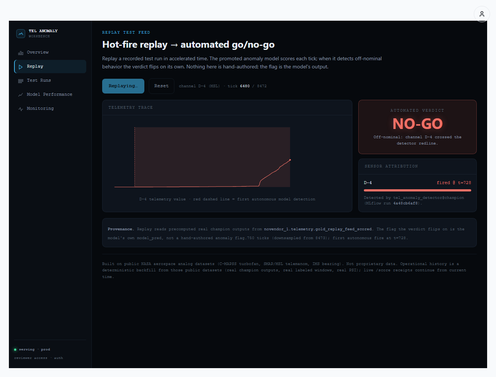
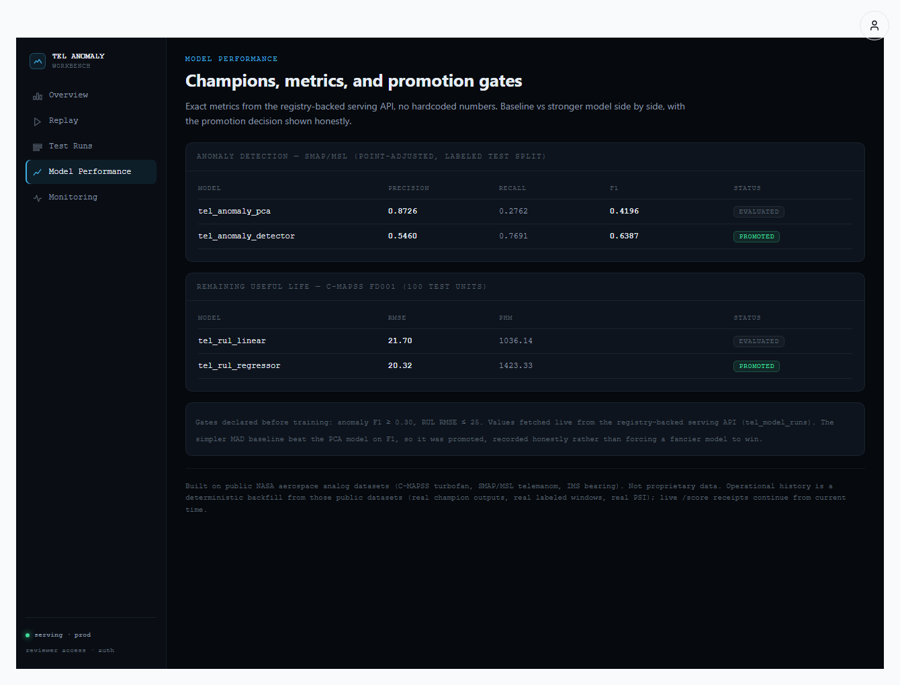

# Reviewer Demo — Telemetry Platform + Test Intelligence Copilot

A skeptical engineer should be able to land here, spend ~4 minutes, and independently conclude:
*"This person can own a test-telemetry platform and apply LLMs to it safely."* This runbook makes that
repeatable without depending on anyone's memory.

Built on **public NASA aerospace analog datasets** (C-MAPSS turbofan RUL, SMAP/MSL telemanom anomaly
detection). Not proprietary data.

---

## 1. Login / auth flow

**Reviewer credential (recommended — scoped to telemetry only).** On the standard login page
(**https://novendor.ai/login**), sign in with the dedicated reviewer username/password:

- username: `telemetry`
- password: `relativity_11`

You land **directly** on the Telemetry Demo Console
(`/lab/env/dc82d39d-9be2-49b0-a01d-c7181b13a8b6/telemetry`). This credential is **scoped**: it can
reach only the telemetry pages below and the telemetry API; it has **no** admin, provisioning,
other-environment, or general Winston-workspace access (the middleware redirects/403s anything else).
Wrong credentials return a normal login error.

Credentials are configured server-side via env vars (not in source): `TELEMETRY_REVIEWER_USERNAME`,
`TELEMETRY_REVIEWER_PASSWORD`, `TELEMETRY_REVIEWER_ENV_ID`. If they are unset, reviewer login is
disabled (fail closed). Mechanics: the login form routes a non-email username to
`POST /api/auth/telemetry-login`, which mints a scoped `bm_session` (role `telemetry_reviewer`,
`platform_admin: false`, a single membership on the telemetry env) — it never touches the Supabase
admin path.

**Admin (unchanged).** Click the **person icon** top-right (or `/login`) and sign in with Supabase
email/password — email `info@novendor.ai`, password in `docs/reference/ENV_KEYS.md`
(`NOVENDOR_ADMIN_PASSWORD`). The reviewer credential does not affect this path.

The app is auth-gated. A cold (no-cookie) hit on a reviewer route correctly `307`-redirects to
`/login` — that proves the route is live *and* gated.

## 2. Production reviewer routes

Environment id: `dc82d39d-9be2-49b0-a01d-c7181b13a8b6`.

| Page | Route |
|---|---|
| Overview (KPIs, model registry, drift) | `https://novendor.ai/lab/env/dc82d39d-9be2-49b0-a01d-c7181b13a8b6/telemetry` |
| **Replay** (the money-shot) | `.../telemetry/replay` |
| **Test Intelligence Copilot** | `.../telemetry/copilot` |
| Model Performance | `.../telemetry/model-performance` |
| Monitoring | `.../telemetry/monitoring` |

## 3. The 4-minute script

1. **Replay (≈60s).** Open `.../telemetry/replay`, click **Replay test feed**. The trace advances in
   accelerated time; the **automated verdict flips GO → NO-GO at tick 728** on its own — that flag is
   the promoted model's own output, not hand-authored. The sensor-attribution panel names channel
   **D-4** and the champion model + MLflow run.
2. **Explain this verdict (≈90s).** With the verdict at NO-GO, click **Explain this verdict →**. A live
   grounded answer appears, citing the real prediction receipt, anomaly score, threshold, champion
   model, MLflow run, and out-of-sample F1 — with a visible **evidence trail** (the tool calls it made)
   and a **governance strip** (answer source, prompt version, model).
3. **Refusal demo (≈30s).** Open `.../telemetry/copilot`, click the **⛔ "What caused it?"** chip (or ask
   any physical-root-cause / safety question). It **refuses before any tool or model call**
   (`unsupported_question`, 0 tools) — the copilot answers only from recorded evidence, never root
   cause or safety disposition.
4. **Draft test report (≈60s).** Back on the explanation (or any grounded copilot answer), click
   **Draft test report →**. It assembles a markdown report **only from real evidence**, labeled
   `ASSISTANT-GENERATED DRAFT — REQUIRES HUMAN REVIEW`, with the full provenance and a **Download .md**
   button. The report is persisted with a report receipt and is re-fetchable.
5. **Governance (≈20s).** Scroll the copilot page's **AI Governance** panel: grounded rate, refusal
   rate, latency, answer-source mix, active prompt hash — all aggregated from real logged interactions,
   nothing hardcoded.

The chain a reviewer sees end to end:

> **GO → NO-GO → Explain verdict → Draft test report → Evidence trail → Human review required.**

## 4. Exact expected evidence values

The flagship D-4 explanation/report cite these real values (verifiable in the answer + evidence cards):

| Field | Value |
|---|---|
| First autonomous model fire (replay) | **t = 728** |
| Prediction receipt id | **`f8e8f23e-1da9-4f27-8785-175bd59d9e6b`** |
| Anomaly score | **2.46062** |
| Redline threshold | **0.135467** (= MAD_K 4.0 × train scale 0.033867) |
| Triggering window | **[726–728]** |
| Champion model | **`tel_anomaly_detector` v1** (alias `champion`) |
| MLflow run | **`4a48cb6a…`** (`4a48cb6af8714609b9581d66e904544c`) |
| Out-of-sample F1 / precision / recall | **0.6387** / 0.5460 / 0.7691 (point-adjusted — legacy) |
| Honest point-wise F1 (same predictions) | **0.313** (event recall 0.77) — see [docs/BENCHMARK_CRITIQUE.md](docs/BENCHMARK_CRITIQUE.md) |

Cold API spot-checks (no login needed — the copilot API isn't cookie-gated; the page is):

```bash
B=https://novendor.ai/api/telemetry; biz=7e1eb000-0000-4000-a000-000000000001
curl -s $B/replay | jq .first_model_fire_t          # 728
curl -s -X POST $B/copilot/explain-verdict -H 'content-type: application/json' \
  -d '{"env_id":"telemetry-demo","business_id":"'$biz'","run_key":"smap_msl:D-4:test","verdict":"NO_GO","fire_tick":728,"channel":"D-4"}'
curl -s -X POST $B/copilot/draft-report   -H 'content-type: application/json' \
  -d '{"env_id":"telemetry-demo","business_id":"'$biz'","run_key":"smap_msl:D-4:test","fire_tick":728,"channel":"D-4"}'
```

## 5. What NOT to claim

- **No proprietary data.** Public NASA aerospace *analog* datasets only (C-MAPSS, SMAP/MSL).
- **No physical root cause.** The model output is a statistical threshold crossing, not a cause.
- **No final safety/engineering disposition.** Reports are drafts requiring human review.
- The 256-d fused state vector (Phase 7A) is a fused *analog* representation aligned by normalized
  sequence progress — not simultaneous multi-sensor vehicle telemetry.

## 6. Known caveats

- **CI:** the Azure DevOps pipelines are frequently red for **pre-existing, repo-wide** reasons
  unrelated to this work (documented in `docs/tips.md`). The telemetry work's own tests + typecheck
  pass.
- **Deploys are manual:** Railway (backend) is not GitHub-connected and Vercel/`novendor.ai` does not
  auto-deploy on push — deploys are run explicitly, so `main` and production can differ until a deploy.
  Current production is verified at parity (deployed backend SHA is an ancestor of `main`).
- **Auth-gated:** the UI requires login; cold routes redirect to `/login` (this is correct behavior).
- **Branch history:** this shipped via PR #118 from the legacy-named branch `feat/hr-morning-book-v1`
  (a naming holdover) — it is **merged to `main`**; the branch name is not meaningful.

## 7. Screenshots

Captured (real, in repo — `telemetry-platform/docs/screenshots/`):

- **Replay after GO→NO-GO at t=728** — 
- **Model performance** (champion vs challenger, exact metrics) — 

To capture (authenticated, ~2 min in a logged-in browser — these pages are auth-gated, so they
can't be captured headlessly from the build session). Save each into
`telemetry-platform/docs/screenshots/` with the exact filename, then embed it here with
``:

| # | Page / state to show | Route (after login) | Save as |
|---|---|---|---|
| 1 | **Explain verdict** — the grounded answer + evidence cards + tool/evidence trail, after clicking "Explain this verdict →" on the NO-GO replay | `/lab/env/dc82d39d-…/telemetry/replay` → Replay → wait for NO-GO → Explain this verdict | `copilot_explain_verdict.png` |
| 2 | **Draft test report** — the `DraftReportCard` with the amber `REQUIRES HUMAN REVIEW` banner + provenance + report body | `/lab/env/dc82d39d-…/telemetry/copilot` → ask "Why NO-GO?" → Draft test report → | `copilot_draft_report.png` |
| 3 | **AI Governance dashboard** — "What this proves" strip + metric strip + eval table + recent interactions | `/lab/env/dc82d39d-…/telemetry/governance` | `governance.png` |

(Full env id in §2. The replay-NO-GO and model-performance shots above already cover 2 of the 5 the
reviewer pack calls for; the three here complete it.)

See `telemetry-platform/docs/portfolio-proof.md` for the 2-minute written summary, and
`telemetry-platform/PROOF.md` for the full per-phase evidence log.
