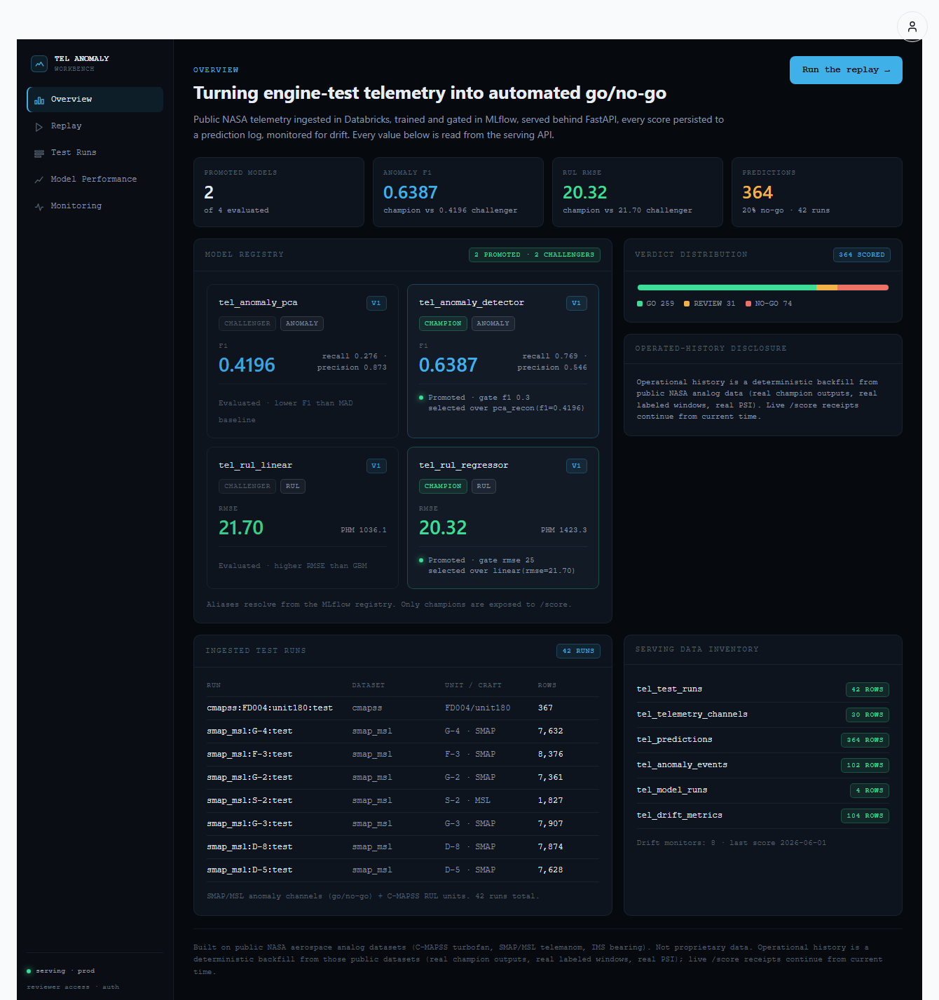

# Telemetry Platform + Applied-AI Copilot — Portfolio Proof

*A 2-minute read. Built on public NASA aerospace analog data (C-MAPSS, SMAP/MSL) — not proprietary
data.*

## Problem

Test telemetry is high-volume and unforgiving: an anomaly that fires late, or a "go" call no one can
explain, costs real money and trust. The job is a platform that ingests telemetry, learns a baseline,
flips an automated go/no-go on its own, and then lets a human **understand, govern, and act** on that
call — without the AI ever overclaiming.

## Architecture (end to end, all real)

```
Databricks NASA ingest (Bronze/Silver/Gold medallion)
  → MLflow training + registry promotion (champion alias, declared gates)
  → Supabase tel_* serving schema (RLS by env_id)
  → FastAPI serving (lean — no ML deps in the app)
  → Winston lab dashboard (dark operator console)
  → deterministic GO → NO-GO replay (the model's own output flips the verdict)
  → grounded Test Intelligence Copilot ("Explain this verdict")
  → Draft test report (assembled only from real evidence)
  → HUMAN REVIEW REQUIRED
```

## Proof points (real values, not illustrative)

- **It moves on its own.** The replay flips **GO → NO-GO at t=728** from the promoted model's own
  `model_pred`, not a scripted flag. 
- **It's grounded.** "Explain this verdict" cites the real prediction receipt
  `f8e8f23e-1da9-4f27-8785-175bd59d9e6b`, anomaly score **2.46062**, threshold **0.135467**, champion
  **`tel_anomaly_detector` v1**, MLflow run **`4a48cb6a…`**, out-of-sample **F1 0.6387**.
- **It refuses.** Physical-root-cause / safety / proprietary questions are declined
  (`unsupported_question`) **before any tool or model call**.
- **It produces an artifact.** "Draft test report" persists a provenance-stamped markdown report
  (`tel_copilot_reports`) labeled `ASSISTANT-GENERATED DRAFT — REQUIRES HUMAN REVIEW`, re-fetchable by
  receipt.
- **It's measured.** A governance panel reports grounded rate, refusal rate, latency, answer-source
  mix, and the active prompt hash — all from real logged interactions.
  

## Applied-AI controls (the safety story)

- **Deterministic planner, not a free agent.** Intent is classified and out-of-scope questions are
  refused *before* the LLM. A frozen intent→tool map drives a **fixed read-only tool allow-list** —
  the model never selects tools; it only narrates already-fetched evidence.
- **Post-validator.** Every id/number in a live answer must trace to the evidence; on
  timeout/error/violation it falls back to a deterministic template — never a silent invention.
- **Fail-closed.** No evidence ⇒ `null_reason`, no answer, no persisted report.
- **Auditable.** Every interaction and report is a logged receipt with prompt-version provenance.
- **Lean + isolated.** No ML deps in the serving app; the copilot is self-contained (no coupling to
  the broad chat gateway).

## Production routes

- App: `https://novendor.ai` (log in via the person icon; see `telemetry-platform/REVIEWER_DEMO.md`).
- Replay: `https://novendor.ai/lab/env/dc82d39d-9be2-49b0-a01d-c7181b13a8b6/telemetry/replay`
- Copilot: `https://novendor.ai/lab/env/dc82d39d-9be2-49b0-a01d-c7181b13a8b6/telemetry/copilot`

## Tests & smokes

- Backend: 23 tests (copilot intent/refusal/allow-list/post-validator/fail-closed + serving), plus the
  256-d fused-vector verifier. Frontend `tsc` clean.
- Cold production smoke (no cookies) on `/replay`, `/copilot/explain-verdict`, `/copilot/draft-report`,
  `/copilot/report/{id}`, `/copilot/governance` — all pass; fail-closed paths verified.
- Full per-phase evidence (with exact run/metric values): `telemetry-platform/PROOF.md`.

## What this demonstrates for Director of Applied AI

The platform doesn't just *use* an LLM — it shows how to apply one **safely inside an analytics system
where mistakes matter**: scoped use cases, controlled tool access, evidence-grounded answers,
enforced refusals, a deterministic fallback, audit receipts, eval-able governance, and a hard
human-review gate on every artifact. Detection → grounded explanation → governed evidence → reviewable
report → human decision. That is decision infrastructure, not a chatbot.
