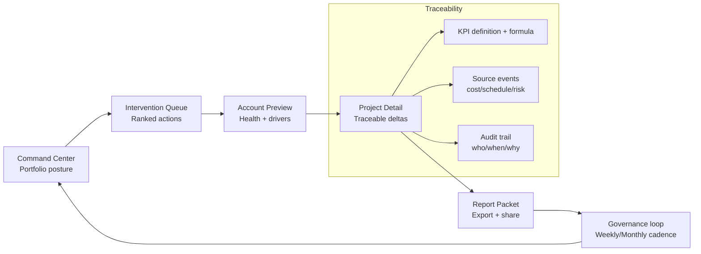
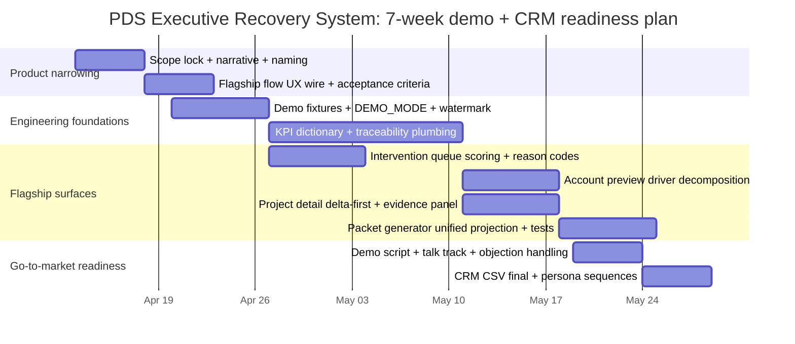

# Narrowing Consulting_app PDS v2 into a Flagship Product: PDS Executive Recovery System

## Executive summary

You can win PDS work away from large incumbents by **not** trying to out-platform them. They already pair delivery services with mature (often partnered) project-management stacks, and they monetize coordination, reporting, governance, and risk transfer. The opportunity for Consulting_app PDS v2 is to become a **fast-to-implement “executive recovery layer”** that replaces the ugliest part of the machine: manual status translation, fragmented metrics, and slow intervention loops—while integrating with whatever systems the owner already uses.

The flagship should narrow PDS v2 into one sharp, demoable story with a single user promise:

**“In 5 minutes, an executive knows what’s drifting, why it’s drifting, what to do next, and can export an audit-ready packet.”**

That translates into one non-negotiable flagship flow:

**Command Center → Intervention Queue → Account Preview → Project Detail → Report Packet (export/share)**

The core product risks are not “features missing,” but **trust and narrative**:
- If KPIs can’t be traced to sources, executives won’t act on them (and procurement will block rollout).
- If seeded/demo data isn’t clearly bounded, credibility suffers immediately.
- If the flow branches into “everything PDS,” the demo becomes a platform tour. Platform tours rarely convert.

This report provides: a flagship scope definition; a repo-inventory rubric and extraction approach (repo access is needed to enumerate exact files and endpoints); a prioritized gap backlog with concrete dev tasks and S/M/L effort; a Codex-style developer prompt to generate a runnable demo from repo artifacts; a November CRM import plan including CSV mapping and outreach messaging; a 25-profile target list for mid-market owners managing 5–50 concurrent projects; and a competitor analysis grounded in official product/service pages.

## Flagship definition and reference flow

### Product definition

The **PDS Executive Recovery System** is a narrow PDS v2 product slice that:
- synthesizes cost / schedule / risk / closeout / staffing signals into a single executive posture,
- ranks the “few interventions that matter,”
- provides drill-down that answers *why* something is red,
- generates a repeatable “executive packet” (PDF + links) for governance routines.

It is explicitly **not** trying to replace field tools, RFIs/submittals systems, or contractor collaboration end-to-end in the first flagship. It is a **recovery and governance layer**.

### Flagship flow diagram



### UI grounding

image_group{"layout":"carousel","aspect_ratio":"16:9","query":["construction executive dashboard portfolio posture","capital projects intervention dashboard risk queue","project controls dashboard cost schedule variance","executive report packet construction projects"],"num_per_query":1}

## Repository assets inventory and readiness rubric

### Current constraint

This chat environment does **not** currently have access to your Consulting_app repository through connected sources or uploaded files, so I cannot truthfully enumerate specific repo file paths, endpoints, or tests from primary repo artifacts. The rest of this section therefore provides (a) a **precise inventory schema** for the flagship flow and (b) a **copy/paste inventory extraction routine** that will generate the exact table you asked for once run locally in the repo.

### Inventory schema for the flagship flow

The flagship requires exactly five “product surfaces.” Each surface should exist in three layers: API contract, UI route/view, and tests/fixtures.

| Flagship surface | Required API contract (minimum) | Required UI deliverable | Minimum tests/fixtures | “Production-ready” signals | “Likely shell” signals |
|---|---|---|---|---|---|
| Command Center | `GET /pds/v2/command-center?scope=` returns posture + KPI tiles + top risks | Single landing page route that renders within 2s from local fixtures | Contract test for JSON shape + snapshot fixture | Stable schema; deterministic fixture; error states handled | Hardcoded UI tiles; TODO metrics; no error/loading states |
| Intervention Queue | `GET /pds/v2/interventions?scope=&status=` returns ranked interventions with reason codes | Queue view with filters; click-through to account/project | Ranking test fixture; paging test | Rank ordering deterministic; “why” field populated; reason codes enumerated | Free-text reasons only; no stable IDs; reorders unpredictably |
| Account Preview | `GET /pds/v2/accounts/{id}/preview` returns health, drivers, and critical projects | Account page summarizes drivers + money/time deltas | Unit tests for driver breakdown; fixture with at least 2 accounts | Drivers add up; “what changed” exists; drilldowns link correctly | One big score only; no decomposition; dead links |
| Project Detail | `GET /pds/v2/projects/{id}` returns traceable deltas + event log pointers | Project page with “why red” + traceable sources | Tests that “red → explanation” is non-empty | KPI → formula → source events visible; audit trail fields exist | “Red because red”; categories without evidence |
| Report Packet | `POST /pds/v2/report-packets` with scope + ids → returns packet id + signed URL | “Generate packet” button + progress + download | Golden packet fixture + render test | Packet includes same numbers as UI; reproducible output | Packet is a static PDF; mismatched numbers |

### Inventory extraction: run locally and paste output

Run the following from the repo root to generate a concise inventory for **files, endpoints, and tests** tied to the five surfaces (command-center, intervention queue, account preview, project detail, report packet). This is designed to work even if you don’t know the code layout.

```bash
# 1) Fast keyword map (paths + line hits)
rg -n --hidden --glob '!.git' \
  "pds/v2|command[-_ ]center|intervention|queue|account preview|account[-_ ]preview|report packet|report[-_ ]packet|packet generation|/pds" \
  .

# 2) Likely API route files (adjust extensions as needed)
find . -type f \( -name "*route*.py" -o -name "*routes*.py" -o -name "*controller*.ts" -o -name "*router*.ts" -o -name "*api*.ts" -o -name "*api*.py" \) \
  | head -n 200

# 3) Likely frontend entry points
find . -type f \( -name "*page*.tsx" -o -name "*route*.tsx" -o -name "*View*.tsx" -o -name "*Screen*.tsx" \) \
  | rg -n "pds|command|intervention|account|report|packet" || true

# 4) Test surfacing
find . -type f \( -name "test_*.py" -o -name "*test*.py" -o -name "*.spec.ts" -o -name "*.test.ts" -o -name "*.spec.tsx" -o -name "*.test.tsx" \) \
  | rg -n "pds|command|intervention|account|report|packet" || true

# 5) If OpenAPI exists
find . -type f \( -name "*openapi*.yml" -o -name "*openapi*.yaml" -o -name "*swagger*.yml" -o -name "*swagger*.yaml" -o -name "*openapi*.json" \) \
  -maxdepth 6
```

When you paste the `rg` results back into this thread, I can convert them into the exact **inventory table** you requested with “production-ready vs shell” classification grounded in the repo’s actual artifacts (tests present, fixtures present, schema stable, etc.).

## Prioritized gap backlog with concrete dev tasks and effort

### Scope-lock principle

Before building anything new, enforce this constraint:

**No new PDS v2 features ship unless they strengthen one of the five flagship surfaces.**

That’s how you avoid “platform sprawl” and ship a sellable flagship.

### Gap backlog

Effort sizing: **S = 1–2 dev-days**, **M = 3–7 dev-days**, **L = 2–4 dev-weeks** (can vary with codebase complexity).

| Priority | Gap | Concrete dev tasks | Acceptance criteria | Effort |
|---:|---|---|---|:--:|
| 1 | KPI trust is not provable (traceability) | Implement **KPI dictionary** (definitions + formulas + units + source tables); add “Why this is red” panels that reference the dictionary; add event pointers (e.g., cost events, schedule slips, risk log changes) | Every red/yellow indicator has: definition, driver decomposition, last-change timestamp, and source-event references | L |
| 2 | Intervention Queue lacks deterministic “why” | Create intervention reason codes and scoring model; store score inputs; show top 3 drivers per intervention; add stable IDs | Queue order is consistent for the same dataset; “why” is structured; filters don’t reorder randomly | M |
| 3 | Packet numbers drift from UI numbers | Create a single **reporting projection layer** used by both UI and packet generator; add golden-fixture test that compares UI JSON → packet JSON | Packet and UI match on all KPIs (within tolerance if rounding is defined); diff tests pass | M |
| 4 | Demo data credibility | Add `DEMO_MODE=1` and deterministic fixture loader; watermark demo outputs; clearly separate demo fixtures from production connectors | Demo never calls external systems; output visibly marked demo; fixtures versioned | M |
| 5 | “Command Center” language is internal | Rename in UI copy to buyer language: “Operating Posture”, “Interventions”, “Executive Packet”; tighten info hierarchy | A first-time user can tell what the product does in <60 seconds without explanation | S |
| 6 | Project Detail lacks the executive drilldown | Add **delta-first** project view: what changed this week, why it changed, next actions, owners; add “evidence” panel | At least one project shows a full red→explanation→action chain | M |
| 7 | Slow or fragile local run | Add one-command bootstrap (make target / script), seed DB or fixture server, document env vars | New dev can run demo locally in <30 minutes | M |
| 8 | Missing procurement-ready artifacts | Add role-based access story, audit log attributes, data handling statement for demo | Security posture and data boundaries are explainable in 1 page | S–M |

### Delivery timeline (4–8 weeks)



## Codex-style developer prompt to generate a runnable demo from repo artifacts

Below is a developer-facing prompt you can drop into Codex (or your internal coding agent) to produce a runnable demo grounded in your repository. It is designed to succeed even if code layout differs, by requiring discovery steps first.

```text
SYSTEM: You are a senior full-stack engineer. Your task is to narrow Consulting_app PDS v2 into a single runnable demo called “PDS Executive Recovery System.” You must use existing repo artifacts wherever possible and only add minimal new code. You must not invent data sources; demo must run fully offline using deterministic fixtures.

GOAL (NON-NEGOTIABLE):
Implement a single demo path with this user flow:
1) Command Center (portfolio posture)
2) Intervention Queue (ranked actions)
3) Account Preview (health + drivers)
4) Project Detail (traceable deltas)
5) Report Packet generator (export)

SUCCESS CRITERIA:
A) Demo runs locally in <30 minutes from a clean checkout using documented commands.
B) Demo requires no external services (no SaaS APIs, no prod credentials).
C) All five surfaces render with real data from fixtures (not hardcoded UI).
D) Every red/yellow indicator has at least one “why” explanation backed by traceability:
   - KPI definition (name, formula, units)
   - last-updated timestamp
   - evidence/source events (even if from fixture “events” arrays)
E) A packet export can be generated that matches the UI KPIs (within defined rounding rules).
F) Automated tests exist that validate the demo dataset and core contracts.

PHASE 0 — DISCOVERY (MANDATORY OUTPUT):
0.1 Read README.md, package.json, backend entrypoints, docker-compose (if present).
0.2 Identify:
    - Frontend framework & run command (e.g., pnpm dev / npm run dev)
    - Backend framework & run command (e.g., uvicorn / flask / fastapi / node)
    - Test commands for frontend and backend
    - Existing PDS v2 endpoints and any existing test files mentioning pds/v2
0.3 Produce a short “Repo Map” note (paths + commands) as part of your PR/patch notes.

PHASE 1 — DEFINE THE DEMO CONTRACT (DO NOT BREAK EXISTING):
1.1 Locate existing PDS v2 endpoints. If endpoints already exist for command center, interventions, account preview, project detail, and report packets, reuse them.
1.2 If any endpoint is missing, implement it behind DEMO_MODE=1 ONLY, returning fixture-backed responses.
1.3 Define a minimal JSON schema for each endpoint. Store schemas in /docs or /schema:
    - command_center.json
    - interventions.json
    - account_preview.json
    - project_detail.json
    - report_packet.json
Each schema must contain:
    - stable ids
    - timestamps
    - KPI fields with units
    - explanation fields (reason codes + text)
    - evidence pointers (event ids)

PHASE 2 — FIXTURES (DETERMINISTIC, OFFLINE):
2.1 Create fixtures folder e.g. /fixtures/pds_exec_recovery_demo/.
2.2 Provide:
    - 2 accounts
    - 6 projects across those accounts
    - at least 3 interventions
    - cost events, schedule slip events, closeout blockers
    - at least 1 “red” and 1 “yellow” scenario with traceable explanations
2.3 Add DEMO watermark behavior:
    - UI banner: “DEMO DATA”
    - Packet footer: “DEMO DATA”
2.4 Add a fixture version file: fixtures/VERSION.json with semver.

PHASE 3 — UI NARROWING:
3.1 Create a single entry route (e.g., /pds-exec-recovery or similar).
3.2 Ensure it only exposes the five surfaces, in-order.
3.3 Rename visible text to buyer language:
    - “Operating Posture” instead of “Command Center” (optional)
    - “Interventions”
    - “Account Health”
    - “Project Recovery”
    - “Executive Packet”
3.4 Add loading + error states that are polished.
3.5 Add “Why?” panels driven by the API explanation fields. No placeholder lorem.

PHASE 4 — REPORT PACKET:
4.1 Implement packet generation:
    - user clicks “Generate Executive Packet”
    - backend returns packet_id and a downloadable artifact (PDF preferred; HTML ok if PDF is hard)
4.2 Ensure numbers match UI projection layer:
    - Single projection function/module used by both UI JSON and packet builder.
4.3 Store generated artifacts in a local temp directory and serve via backend route.

PHASE 5 — TESTS (REQUIRED):
5.1 Add contract tests for each endpoint: validate schema + required fields.
5.2 Add a golden test that asserts packet KPIs equal command center KPIs for the same scope.
5.3 Add a smoke test script:
    - starts services
    - hits endpoints
    - generates packet
    - verifies download returns 200
5.4 Ensure tests run with one command documented in README.

PHASE 6 — LOCAL RUN STEPS (REQUIRED OUTPUT):
Create /docs/DEMO_RUNBOOK.md with:
- prerequisites
- env vars (include DEMO_MODE=1)
- install commands
- start commands
- URLs to open
- how to regenerate fixtures
- how to run tests

EXPECTED INPUTS:
- DEMO_MODE=1
- Optional: DEMO_SCOPE=portfolio or account_id
- No external secrets required

EXPECTED OUTPUTS:
- Running demo route
- Working “Generate packet” button
- Passing tests

DELIVERABLE FORMAT:
- Provide a single PR or patch set.
- Include a short change log.
- Highlight any assumptions and any endpoints you added.
```

## CRM import plan for November

### Buyer personas and what each is trying to “recover”

| Persona | What they’re accountable for | What breaks today | Message you lead with |
|---|---|---|---|
| Executive sponsor (CRE / Facilities / Development leader) | Predictability of capital delivery + reputation | Surprises; “why is this red?”; board-level packets | “In 5 minutes: posture → actions → packet.” |
| Operations leader (PDS / PMO / Project Controls) | Throughput + governance | Manual reporting, duplicate entry, meeting overload | “We eliminate status stitching and create traceable KPIs.” |
| Procurement / Finance partner | Control, auditability, vendor rationalization | Tool sprawl, unclear ROI, data handling risk | “Overlay model, deterministic audit trail, minimal change management.” |

### Import mechanics: what your CSV must support

If you’re using entity["company","Salesforce","crm software vendor"], the Data Import Wizard supports CSV imports for standard objects (accounts, contacts, leads, etc.) and caps typical imports at 50,000 records per job. citeturn5search4  
If you’re using entity["company","HubSpot","crm software vendor"], their import tooling emphasizes a header row and mapping columns to object properties, and supports common spreadsheet formats including CSV/XLSX. citeturn5search0turn5search6  
If you’re using entity["company","Pipedrive","crm software vendor"], imports rely on mapping spreadsheet columns to object fields and require mandatory fields depending on object type; it also provides guidance on mandatory fields and mapping. citeturn5search1turn5search7turn5search9  
If you’re in entity["company","Microsoft","technology company"] Dynamics environments, Microsoft’s guidance highlights required fields, delimiter correctness, and mapping discipline for successful imports. citeturn5search2turn5search5

### November CRM import CSV template and field mapping

This template is designed to import cleanly into Salesforce/HubSpot/Pipedrive with minimal customization. Add/remove columns based on your CRM object model.

| CSV column | Purpose | Salesforce mapping (common) | HubSpot mapping (common) | Notes |
|---|---|---|---|---|
| `company_name` | Account identity | Account Name | Company Name | Dedupe key candidate |
| `company_domain` | Dedupe + enrichment | Website (or custom) | Company Domain Name | Helps avoid duplicates |
| `hq_city` / `hq_state` | Segmentation | Billing City/State | City/State | Optional |
| `industry_segment` | Targeting | Industry (or custom) | Industry (or custom) | Use a controlled vocabulary |
| `portfolio_type` | Fit scoring | Custom field | Custom property | e.g., retail rollout, clinic network |
| `active_projects_est` | Fit scoring | Custom | Custom | Integer estimate (5–50) |
| `trigger_event` | Why now | Custom | Custom | e.g., “rapid rollout,” “capex scrutiny” |
| `target_role_primary` | Persona routing | Title (lead/contact) | Job Title | Use standardized role buckets |
| `contact_first_name` | Contact | First Name | First Name | If known |
| `contact_last_name` | Contact | Last Name | Last Name | If known |
| `contact_email` | Contact | Email | Email | Key identifier (HubSpot often uses Email for contacts) citeturn5search0turn5search6 |
| `contact_phone` | Contact | Phone | Phone Number | Optional |
| `linkedin_url` | Context | Custom | Custom | Optional |
| `sequence_variant` | A/B testing | Custom | Custom | executive / operations / procurement |
| `owner` | Routing | Lead/Account Owner | Record owner | Your SDR/AE assignment |
| `notes` | Memory | Description | Notes | Keep short |

Recommended CSV header (copy/paste):

```csv
company_name,company_domain,hq_city,hq_state,industry_segment,portfolio_type,active_projects_est,trigger_event,target_role_primary,contact_first_name,contact_last_name,contact_email,contact_phone,linkedin_url,sequence_variant,owner,notes
```

### Outreach messaging: three variants

**Executive sponsor email (predictability + packet)**  
Subject: “Executive posture + packet in 5 minutes (capital programs)”  
Body: You probably have the same weekly problem every portfolio leader has: you don’t lack status—you lack **confidence**. Too many programs go “yellow” quietly, and the org only discovers why once the executive packet is already due or a project has escalated.  
We built a narrow tool called the *PDS Executive Recovery System*: one view of operating posture, a ranked intervention queue (what actually needs action), drill-down that explains *why* something is red, and one-click generation of an executive-ready packet.  
It’s not another PM system; it’s a recovery layer that overlays your current tools and replaces the manual stitching (Excel, PDFs, recurring meetings). If you can spare 20 minutes, I can show a runnable demo and the exact KPI traceability model (definition → driver → evidence).  

**Operations leader email (remove wasted motion + traceability)**  
Subject: “Eliminate status stitching + make KPIs traceable”  
Body: Most PDS teams aren’t short on effort—they’re short on **throughput** because reporting and coordination consume the week. The biggest time sink is manual translation: project updates → rollups → packet assembly → follow-ups when leadership asks “why.”  
The PDS Executive Recovery System is designed to remove that loop. It standardizes the KPI dictionary, builds an intervention queue with reason codes (not hand-wavy red/yellow), and makes every metric traceable to underlying events. The result is fewer meetings, fewer re-forecasts, faster escalation, and consistent governance outputs.  
If you’re managing 5–50 concurrent projects, this is where you get leverage: recover time from admin and reinvest it in real risk mitigation.

**Procurement/finance email (risk + auditability + change management)**  
Subject: “Overlay model: audit trail + less tool sprawl”  
Body: I’m reaching out because most capital-program tooling initiatives fail for predictable reasons: vendor lock-in, unclear data provenance, and change management burden.  
Our approach is intentionally narrow: the PDS Executive Recovery System is an overlay that reads structured project signals (or uses deterministic fixtures for demo), produces a traceable posture, and generates repeatable governance packets. Every KPI has a definition and an evidence trail, and demo mode is clearly watermarked and bounded.  
This typically reduces the “shadow reporting stack” (spreadsheets, manual packets) without forcing a rip-and-replace of existing systems. If helpful, I can share the data boundary model, the demo runbook, and the mapping needed for a controlled pilot.

### Target list criteria for November

Prioritize accounts where governance pain is inevitable:
- A portfolio with **5–50 concurrent active projects** (new build + remodel + closeout overlap).
- Executive routines: weekly leadership calls, monthly steering committee, board reporting.
- Mix of internal + outsourced PMs (coordination overhead is high).
- Signals of rapid rollout, rebranding, M&A integration, or capex tightening (intervention pressure rises).

## Lead list for mid-market owners managing 5–50 projects

Because “mid-market owners/managers of 5–50 projects” is best identified through **signals** (permits, rollout announcements, capital plans, expanding footprints) rather than a static directory, the list below is structured as **25 actionable target profiles**. Each profile includes the buyer roles to hunt, why they fit the flagship, and a specific intro angle you can use immediately.

| Priority | Example target profile | Buyer roles to target | Why it fits (5–50 project reality) | Suggested intro angle |
|---:|---|---|---|---|
| 1 | Regional grocery chain running remodel + infill builds | VP Facilities; Dir. Construction | Continuous remodel cadence + store openings → constant packet churn | “Posture + interventions across remodel program; generate monthly packet instantly.” |
| 2 | Multi-site urgent care network expanding clinics | Dir. Real Estate; Program Controls | Standardized builds with local variance → governance complexity | “Intervention queue for permitting/schedule drift + executive packet.” |
| 3 | Specialty retail chain executing brand refresh | Head of Store Development | Many small projects create reporting overload | “Replace manual rollups; drill-down for ‘why red’ on top outliers.” |
| 4 | Regional bank branch transformation program | CRE PMO lead; Finance partner | Branch closures/renos create sensitive reporting | “Governance-ready packet + traceable capex drivers.” |
| 5 | Industrial owner/operator upgrading facilities | Facilities exec; Project controls manager | Capex upgrades are risk-heavy and executive-visible | “KPI traceability for cost/schedule/risk; intervention reasons coded.” |
| 6 | Self-storage operator expanding into new markets | SVP Development | Multiple ground-ups + conversions | “Portfolio posture + closeout blockers; unify packet reporting.” |
| 7 | Franchise group operating 30–150 QSR units | VP Development; Construction ops | Constant small works + rebuilds → noisy leadership updates | “Rank interventions; kill status stitching.” |
| 8 | Veterinary clinic network doing rollups + new sites | Real estate lead; Ops finance | Acquisition integration creates tool/data chaos | “Recovery layer across disparate build teams.” |
| 9 | Private K–12 school network adding campuses | COO; Dir. Facilities | Projects are board-visible; governance pressure high | “Board packet generation with evidence-based KPIs.” |
| 10 | Higher ed institution with 10–30 capex projects | AVP Facilities | Diverse project types; executive scrutiny | “Interventions + traceability reduces escalations.” |
| 11 | Regional hospital system outpatient build program | Capital planning lead | Many clinics/renos at once | “Posture + ranked actions; unify packet narrative.” |
| 12 | Hotel group renovating multiple properties | VP Design & Construction | Renovations are deadline-driven | “Intervention queue tied to schedule slips + cost drivers.” |
| 13 | Multifamily owner doing value-add renovations | Asset management + project controls | Renovations across properties are operationally messy | “Make drift visible early; export investor-friendly packet.” |
| 14 | Logistics firm retrofit program (automation readiness) | Facilities engineering; PMO | Electrical/MEP upgrades require tight governance | “Traceability for ‘why late/over’ with evidence events.” |
| 15 | Data center developer with several builds at once | Program controls director | Tight schedule + power constraints | “Intervention queue for permitting/power/schedule; packet for stakeholders.” |
| 16 | Municipal capital program (small portfolio) | City PMO | Public reporting + audits | “Audit trail + reproducible packet output.” |
| 17 | Statewide nonprofit facilities upgrade program | COO; Facilities director | Many small projects with limited staff | “Reduce admin burden; show posture and actions.” |
| 18 | Regional airline/airport vendor facilities upgrades | Program manager | Safety + regulation increases reporting | “Evidence-based KPIs + packet generation.” |
| 19 | Manufacturing group expanding lines | Plant engineering leader | Projects compete for resources | “Resource pressure signals + intervention ranking.” |
| 20 | Entertainment venue operator upgrades | VP Facilities | Deadline-driven with high visibility | “Posture view that makes ‘what changed’ obvious.” |
| 21 | Insurance company consolidating offices | Workplace/CRE leader | Moves + renovations create conflicting data | “Recovery layer across multiple vendors/tools.” |
| 22 | Telecom deploying small cell/field facility program | Program governance lead | High volume of small projects | “Interventions + automation for reporting.” |
| 23 | Public safety/justice facilities renovation set | Program manager | Compliance + reporting heavy | “Traceable metrics and audit-ready packet.” |
| 24 | Private equity portfolio ops team standardizing capex reporting | Operating partner | Cross-portfolio governance is fragmented | “Single posture pattern across portfolio companies.” |
| 25 | Real estate services firm internal PMO overhaul | PMO lead | Tool sprawl + duplicate entry is visible pain | “Overlay model that reduces tool count and reporting cycles.” |

## Competitor analysis and differentiation

### What incumbents sell (and why “we have software” is not enough)

Incumbent PDS providers are already bundling delivery services with formal governance and technology-enabled reporting, which means your differentiation must be (a) **the narrow recovery focus**, (b) **speed-to-value**, and (c) **traceability + overlay** rather than “another PM platform.”

### Competitor offerings grounded in official pages

| Competitor | How they describe the offering | Tech signal from official sources | Implication for your positioning |
|---|---|---|---|
| entity["company","CBRE","global commercial real estate"] | “Project & Program Management” under Design & Build; positions global delivery, and notes partnership breadth. citeturn3search3 | CBRE presents **Kahua** as a core project management technology and describes it as a single source of truth with dashboards/reporting; CBRE also references Kahua as its “single global end-to-end” PM technology. citeturn3search1turn3search0 | Don’t compete on “we have dashboards.” Compete on **executive recovery + traceable drivers + faster deployment** across mixed-tool environments. |
| entity["company","JLL","global commercial real estate"] | Project management/design services and multi-site project management positioned as scalable delivery. citeturn2search0turn2search7 | JLL publicly announced a cloud-based PM technology platform and partnership with **Clarizen** for global PM tech, including integrations and dashboards. citeturn2search5 | Position as “recovery overlay” not a replacement for their PM stack; highlight **intervention ranking + packet repeatability** and minimal change management. |
| entity["company","Cushman & Wakefield","global commercial real estate"] | Project & Development Services described as end-to-end management; Programs & Projects emphasizes governance, metrics, and a “programmatic approach.” citeturn1search1turn4search0 | Cushman & Wakefield announced deployment of **IngeniousIO** as a global project management platform for PDS, describing automation, eliminating duplicate entry, and cloud-based real-time project data. citeturn4search4 | They already claim “single source of truth” and automation. Differentiate on what they *don’t* productize well: **rapid executive clarity, provable KPI traceability, and a recovery-focused operating cadence.** |

Supporting vendor tech context: entity["company","Kahua","construction project management"] positions its platform as asset-centric with real-time collaboration and analytics. citeturn3search6  
entity["company","Clarizen","project management software"] is explicitly referenced by JLL as the platform partner for its PM technology rollout. citeturn2search5  
entity["company","IngeniousIO","project management software"] is explicitly referenced by Cushman & Wakefield as the deployed global PM platform for PDS. citeturn4search4

### Differentiation that will actually land

The most defensible positioning for the PDS Executive Recovery System:

**“An executive recovery overlay that makes drift explainable and governance repeatable—without ripping out existing PM tools.”**

Concretely:
- **Overlay, not replacement:** incumbents often win by bundling delivery + tools; you win by integrating and giving executives clarity quickly.
- **Interventions, not statuses:** queue is ranked and justified with reason codes and evidence—not a list of PM updates.
- **Traceability by design:** every “red” has a definition, a driver decomposition, and evidence pointers (audit-friendly).
- **Packet is a product, not a deliverable:** the executive packet is the output of the same projection that powers the UI, reducing “two truths.”

This is also the shortest path to procurement approval: it is easier to pilot a recovery overlay in one portfolio slice than to displace an incumbent’s end-to-end PM + reporting stack.

